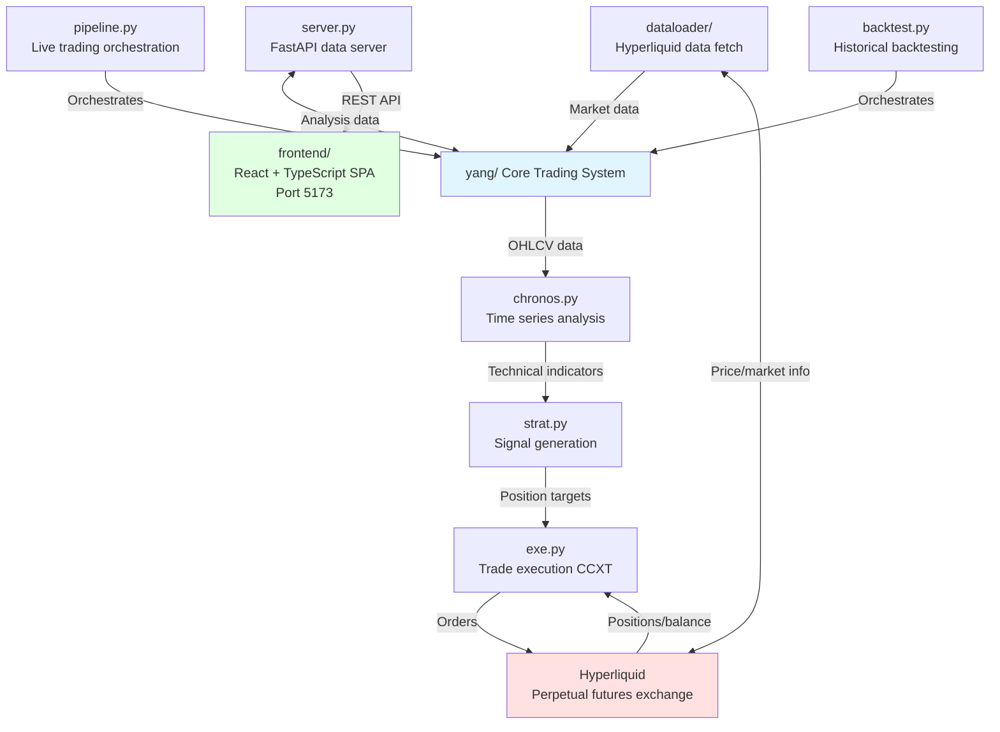

# MoNeyMeNtuuummmmm....

[](https://www.youtube.com/watch?v=FoYC_8cutb0)

A momentum-based cryptocurrency trading system for Hyperliquid perpetual futures, combining time series analysis with automated execution.

## Table of Contents

- [Features](#features)
- [Architecture](#architecture)
- [Getting Started](#getting-started)
- [Usage](#usage)
- [Configuration](#configuration)
- [API Reference](#api-reference)
- [Development](#development)
- [Testing](#testing)

## Features

- **Momentum Trading Strategy**: Automated long/short position generation based on autocorrelation and moving average signals
- **Comprehensive Analytics**: Calculate returns, volatility, Sharpe/Sortino ratios, beta coefficients, and more using PySpark
- **Live Trading Pipeline**: Continuous analysis and portfolio rebalancing on Hyperliquid exchange
- **Historical Backtesting**: Test strategies against historical data with detailed analysis output
- **Interactive Dashboard**: React-based frontend with real-time charts and sortable data tables
- **Risk Management**: Beta-adjusted position sizing with leverage constraints
- **Multi-Timeframe Support**: Configurable analysis windows (15m, 1h, 4h, 1d)

## Architecture

### Core Components



### Data Flow

1. **Data Collection**: `HyperliquidDataLoader` fetches OHLCV candles and market data asynchronously
2. **Analysis**: `Chronos` engine transforms raw data using PySpark (returns, volatility, Sharpe, autocorrelation, etc.)
3. **Signal Generation**: `Strategy.generate_picks()` produces position targets with beta-adjusted weights
4. **Execution**: `ExecutionEngine.rebalance()` reconciles target portfolio with current positions (live only)
5. **Storage**: `backtest.py` saves analysis to `data/analysis_df.csv`
6. **Visualization**: Frontend fetches data from FastAPI server and renders interactive charts

### Technology Stack

**Backend:**
- Python 3.11, PySpark, FastAPI, Pandas, CCXT
- Async I/O for efficient data fetching
- Dataclass-based architecture

**Frontend:**
- React 19, TypeScript, Vite
- TailwindCSS 4, Radix UI components
- LightweightCharts for price visualization
- TanStack Table for data grids

**Development:**
- Nix flakes with devenv for reproducible environments
- Ruff for linting and formatting
- Pre-commit hooks for code quality

## Getting Started

### Prerequisites

- **Nix package manager** with flakes enabled
- **Direnv** (optional but recommended)
- **Hyperliquid API access** (for live trading)

### Installation

1. **Clone the repository**
   ```bash
   git clone <repository-url>
   cd moneymentum
   ```

2. **Activate development environment**
   ```bash
   direnv allow  # With direnv
   # OR
   nix develop   # Without direnv
   ```

3. **Install frontend dependencies**
   ```bash
   cd frontend
   npm install
   ```

4. **Configure environment variables**

   Create a `.env` file (see `.env.example` for required variables):
   ```bash
   HYPERLIQUID_PRIVATE_KEY=your_private_key_here
   HYPERLIQUID_ACCOUNT_ADDRESS=your_account_address
   ```

### Quick Start

**Run backtest** (generates analysis without trading):
```bash
python backtest.py
```

**Start API server**:
```bash
python server.py  # Runs on http://localhost:8000
```

**Launch frontend**:
```bash
cd frontend
npm run dev  # Runs on http://localhost:5173
```

**Run live trading** (requires API credentials):
```bash
python pipeline.py
```

## Usage

### Backtesting

Generate historical analysis and save to CSV:

```bash
python backtest.py
```

Output: `data/analysis_df.csv` with columns for returns, volatility, Sharpe ratio, autocorrelation, z-scores, and position picks.

### Live Trading

Run continuous analysis and rebalancing:

```bash
python pipeline.py
```

Logs: `pipeline.log`

**Warning**: Live trading requires funded Hyperliquid account. Review `yang/strat.py` and `yang/exe.py` before running.

### API Server

Start FastAPI server for frontend data:

```bash
python server.py
```

Endpoints:

- `GET /api/data` - Latest analysis data
- `POST /api/data` - Trigger backtest execution
- `GET /api/date-range` - Available date range
- `GET /api/token/{ticker}` - Token-specific analysis

### Frontend Dashboard

```bash
cd frontend
npm run dev
```

Navigate to http://localhost:5173 to view:

- Interactive price charts with technical indicators
- Sortable/filterable token analysis tables
- Historical performance metrics

## Configuration

### Timeframes

Edit `yang/util.py` to modify `TIMEFRAME_CONFIGS`:

```python
TIMEFRAME_CONFIGS = {
    "15m": TimeframeConfig(
        lookback_periods=672,  # ~7 days
        num_tokens=10,
        annualization_factor=35_040,  # minutes per year
    ),
    # Add custom timeframes...
}
```

### Strategy Parameters

Modify `yang/strat.py`:

- `autocorr_threshold`: Momentum signal threshold (default: 0.5)
- `sma_weight`: Moving average vs autocorrelation weight
- `max_leverage`: Maximum position leverage (default: 3x)

### Risk Controls

Edit `yang/exe.py`:

- `MAX_POSITION_SIZE`: Maximum USD per position
- `REBALANCE_THRESHOLD`: Minimum change to trigger rebalancing

## API Reference

### FastAPI Endpoints

**GET /api/data**

```json
{
  "data": [...],           // Analysis rows
  "columns": [...],        // Column names
  "date_range": {
    "min": "2024-01-01",
    "max": "2024-12-31"
  }
}
```

**POST /api/data**

Triggers backtest execution. Streams progress via Server-Sent Events.

**GET /api/token/{ticker}**

Returns token-specific analysis including OHLCV and calculated metrics.

### Python API

**Strategy.generate_analysis(ohlcv_df)**

Applies Chronos transformations to OHLCV data.

```python
from yang.strat import Strategy

strategy = Strategy(timeframe="15m")
analysis_df = strategy.generate_analysis(ohlcv_df)
```

**Strategy.generate_picks(analysis_df)**

Generates position targets from analysis data.

```python
picks = strategy.generate_picks(analysis_df)
# Returns: {"BTC": 0.5, "ETH": 0.3, ...}  # Weights sum to 1.0
```

## Development

### Common Commands

**Python:**

```bash
ruff check .           # Lint code
ruff format .          # Format code
pytest                 # Run tests
pre-commit run -a      # Run all pre-commit hooks (must pass before completing tasks)
```

**Frontend:**

```bash
cd frontend
npm run dev            # Development server
npm run build          # Production build
npm run lint           # ESLint check
npm run preview        # Preview production build
```

### Code Quality

- **Linting**: Ruff with ~40 rule categories (see `ruff.toml`)
- **Formatting**: Ruff for Python, Prettier for frontend
- **Pre-commit hooks**: Auto-format and lint on commit
- **Type hints**: Enabled for Python (mypy disabled by default)

### Project Structure

```
moneymentum/
├── yang/                      # Core trading system
│   ├── chronos.py            # Time series analysis engine
│   ├── strat.py              # Strategy signal generation
│   ├── exe.py                # Trade execution via CCXT
│   ├── util.py               # Configuration & utilities
│   └── dataloader/           # Hyperliquid data fetching
│       └── hyperliquid/
│           ├── ohlcv.py      # OHLCV candle data
│           ├── funding_rates.py
│           └── markets.py    # Market info & filtering
├── frontend/                  # React SPA
│   ├── src/
│   │   ├── pages/TokenPage/  # Main analysis dashboard
│   │   ├── components/       # Reusable UI components
│   │   └── lib/              # API client & utilities
│   └── package.json
├── pipeline.py               # Live trading orchestration
├── backtest.py               # Historical backtesting
├── server.py                 # FastAPI data server
├── data/                     # Analysis output & cached data
├── tests/                    # Test suite
├── flake.nix                 # Nix development environment
├── ruff.toml                 # Python linting config
└── CLAUDE.md                 # Claude Code instructions

```

### Adding New Features

1. **New indicators**: Add methods to `yang/chronos.py`
2. **Strategy modifications**: Edit `yang/strat.py`
3. **Frontend components**: Add to `frontend/src/components/`
4. **API endpoints**: Extend `server.py`

## Testing

Run test suite:

```bash
pytest
```

Test data available in `test_data/` directory.

Main test file: `tests/test_chronos.py`

## Contributing

1. Fork the repository
2. Create a feature branch (`git checkout -b feature/amazing-feature`)
3. Commit changes (`git commit -m 'Add amazing feature'`)
4. Ensure pre-commit hooks pass (`pre-commit run -a`)
5. Push to branch (`git push origin feature/amazing-feature`)
6. Open a Pull Request

## License

See repository for license information.

## Acknowledgments

Built with PySpark, FastAPI, React, and the Hyperliquid exchange API.
