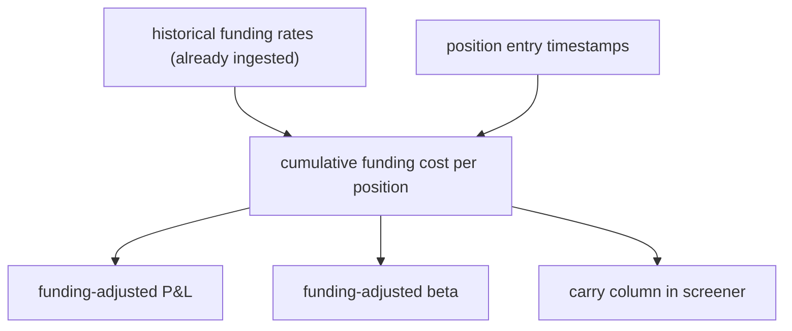
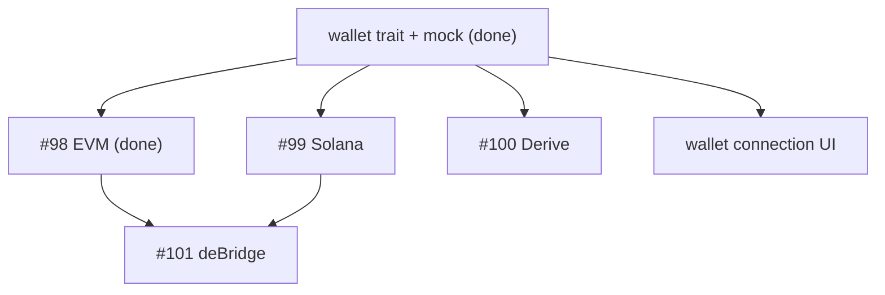
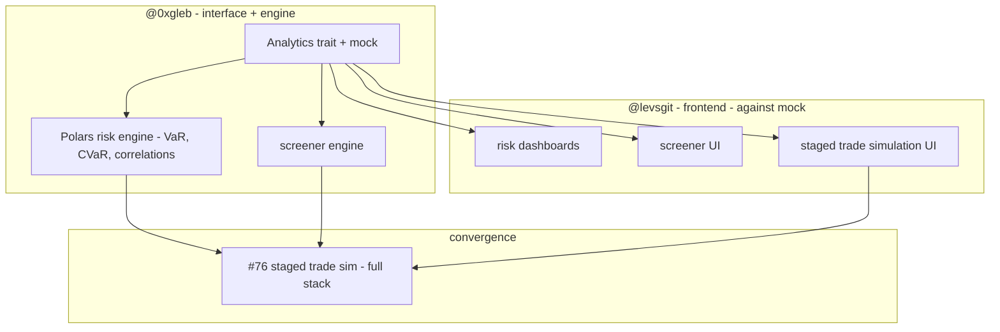

# Roadmap

Practical path from where we are today to the north star in
[SPEC.md](./SPEC.md). Epics are ordered by priority (highest first). [^1]

[^1]: Completed work lives at the bottom in chronological order.

---

## Reliable infrastructure and deployment

Production backend was crash-looping -- systemd's `DynamicUser` mechanism
corrupted its own state, and every restart failed with the same credential
collision error. Meanwhile local deploys broke because devenv's impure
evaluation poisoned `nix flake check`. The daily-use rebalancer was down and we
couldn't ship fixes until deploys worked again.

- [x] [#69 Deployment fails: moneymentum.service exits with status 217/USER](https://github.com/data-cartel/moneymentum/issues/69)
  - PR:
    [#117 fix systemd service crash loop from DynamicUser collision](https://github.com/data-cartel/moneymentum/pull/117)

Watch list (partially addressed by earlier work, revisit if issues resurface):

- [ ] [#81 Add staging environment for pre-production deployments](https://github.com/data-cartel/moneymentum/issues/81)
- [ ] [#79 Scheduled data ingestion (cron)](https://github.com/data-cartel/moneymentum/issues/79)

## Frontend modernization (SolidJS + Effect)

React's virtual DOM diffing adds unnecessary overhead for a data-heavy trading
UI where every millisecond of render lag erodes trust in displayed prices.
SolidJS compiles to direct DOM updates -- fine-grained reactivity without the
VDOM reconciliation tax. Effect-TS replaces untyped throw/catch with typed error
channels, eliminating silent failures in trade execution paths where a swallowed
exception means money.

SolidJS + Effect migration is complete. Python removed, React replaced.

- [x] [PR #93 staged changes](https://github.com/data-cartel/moneymentum/pull/93)
- [x] [PR #94 remove python, update nix](https://github.com/data-cartel/moneymentum/pull/94)
- [x] [PR #95 header + wallet + theme](https://github.com/data-cartel/moneymentum/pull/95)
- [x] [PR #110 beta + fixes + design](https://github.com/data-cartel/moneymentum/pull/110)
- [x] [PR #112 migrate frontend from React to SolidJS](https://github.com/data-cartel/moneymentum/pull/112)
- [x] [PR #113 replace exceptions with typed Effect errors](https://github.com/data-cartel/moneymentum/pull/113)
- [x] [PR #114 rename single-letter variables](https://github.com/data-cartel/moneymentum/pull/114)
- [x] [PR #115 eliminate remaining raw throws](https://github.com/data-cartel/moneymentum/pull/115)
- [x] [PR #116 document PR format](https://github.com/data-cartel/moneymentum/pull/116)

## Funding-adjusted returns

The rebalancer shows position P&L without accounting for funding costs -- the
periodic payments between longs and shorts in perpetual futures. A position that
looks profitable can actually be losing money once funding is factored in.
Without this, portfolio beta is misleading (calculated on raw price returns, not
realized returns), and the screener can't distinguish between a high-carry
position and one bleeding funding.

No wallet or venue dependencies -- **`@levsgit`** can start this immediately.

### Data constraints

The backend already ingests funding rates from Hyperliquid's `funding_history`
endpoint into `funding_rate1h.csv` (columns: `timestamp`, `funding_rate`,
`symbol`). Key constraints:

- **1h granularity only** -- Hyperliquid charges funding hourly at 1/8 of the 8h
  rate. We can't see intra-hour position changes, so funding cost calculation
  assumes constant position size within each hour.
- **~208-day window** -- the API returns at most 5000 records per symbol. For
  longer lookbacks, historical data must be preserved across ingestion runs
  (already handled by `merge_and_deduplicate`).
- **Live vs historical** -- the screener already shows live annualized rates
  from `metaAndAssetCtxs` (`rate * 24 * 365`). What's missing is cumulative cost
  over a holding period.

### What needs to happen

Funding-adjusted return for a position = raw price return - cumulative funding
paid. For each hour the position was open: `position_size * hourly_rate`. Sum
over the holding period. This needs to feed into:

1. **Per-position funding cost** -- total funding paid/received since entry
2. **Funding-adjusted P&L** -- `raw_pnl - cumulative_funding`
3. **Funding-adjusted beta** -- regress funding-adjusted returns (not raw price
   returns) against BTC. The current beta calculation in `useBeta.ts` uses OHLCV
   candles and ignores funding entirely.



- [ ] Cumulative funding cost calculation given position entry time and 1h rate
      history -- **`@levsgit`**
- [ ] Funding-adjusted P&L display alongside raw P&L -- **`@levsgit`**
- [ ] Funding-adjusted beta (replace raw OHLCV returns with net-of-funding
      returns in regression) -- **`@levsgit`**
- [ ] Carry ranking in screener (annualized funding as a factor for screening)
      -- **`@levsgit`**

## TEE-secured wallet signing (Turnkey)

The frontend currently stores raw private keys in the browser and signs via
CCXT's built-in Hyperliquid adapter. This works for a single user on a single
exchange but can't scale to multi-venue execution or fund management -- you
can't ask investors to paste private keys into a browser.

Turnkey runs signing inside AWS Nitro enclaves. Keys never leave attested
hardware, signing latency is 50-100ms, and there's a native Rust SDK. The
`Wallet` trait (PR #108) and Turnkey EVM implementation (PR #109) are already
built.

### What exists

The `Wallet` trait in `crates/wallet/` is minimal by design:

```
trait Wallet {
    type Address, Payload, Signature, Error;
    async fn address() -> Result<Address, Error>;
    async fn sign(payload: &Payload) -> Result<Signature, Error>;
}
```

One instance = one chain + one address. Payload encoding (EIP-712, Solana
serialized tx) is the caller's responsibility. The EVM implementation takes a
pre-hashed keccak256 digest and returns an `alloy_primitives::Signature`.

### What's left

- **Solana wallet** -- implement `Wallet` with `Pubkey` as Address and
  `solana_sdk::signature::Signature` as output. Needed for vault program
  interactions, HumidiFi spot trading, and deBridge bridging.
- **Derive wallet** -- similar to EVM but targeting Derive Chain's RPC.
- **deBridge wallet** -- coordinates signing across both EVM and Solana for
  cross-chain transfers. Depends on both EVM and Solana wallets.
- **Frontend passkey flow** -- replace the current "paste your private key"
  modal with Turnkey's passkey-based authentication. The wallet connection UI
  can be built against the mock wallet while backend implementations proceed.



- [x] [#97 wallet trait + crate architecture](https://github.com/data-cartel/moneymentum/issues/97)
      -- **`@0xgleb`**
  - PR:
    [#107 crate architecture docs](https://github.com/data-cartel/moneymentum/pull/107)
    ->
    [#108 wallet trait + mock](https://github.com/data-cartel/moneymentum/pull/108)
- [x] [#98 Turnkey EVM wallet](https://github.com/data-cartel/moneymentum/issues/98)
      -- **`@0xgleb`**
  - PR:
    [#109 Turnkey EVM implementation](https://github.com/data-cartel/moneymentum/pull/109)
- [ ] [#99 Turnkey Solana wallet](https://github.com/data-cartel/moneymentum/issues/99)
      -- **`@0xgleb`**
- [ ] [#100 Turnkey Derive wallet](https://github.com/data-cartel/moneymentum/issues/100)
      -- **`@0xgleb`**
- [ ] [#101 Turnkey deBridge wallet](https://github.com/data-cartel/moneymentum/issues/101)
      -- **`@0xgleb`**
- [ ] Wallet connection UI (Turnkey passkey flow, replaces raw key input) --
      **`@levsgit`**
- [ ] [PR #96 replace Privy with Turnkey (research + SPEC update)](https://github.com/data-cartel/moneymentum/pull/96)

## Multi-venue capital flow

A perps-only platform on a single exchange can't grow into a fund management
tool. Portfolio managers need to hold spot positions (basis trades, funding arb
with spot hedge), bridge capital across chains, and accept investor deposits.
This epic wires Turnkey signing into actual venue integrations.

### Vault program -- **`@0xgleb`**

The Anchor program handles investor lifecycle: deposits mint share tokens,
withdrawals burn shares and deduct fees, NAV attestations from the backend
determine share price. The program is developed with local keypairs on devnet --
Turnkey Solana wallet plugs in later for production signing.

Key instructions: `initialize_vault`, `deposit` (mint shares at current NAV),
`withdraw` (burn shares, deduct management + performance fees, send net USDC),
`update_nav` (backend posts signed attestation). Fee structure per SPEC: annual
management fee on AUM, performance fee above HWM.

The IDL is the decoupling point -- once published, **`@levsgit`** builds the
deposit/withdraw UI against devnet while the program is still being hardened.

- [ ] Anchor program: vault initialization, deposit/withdraw, share token
      accounting, fee deduction, NAV attestation -- **`@0xgleb`**
- [ ] `VaultClient` crate (Rust client for the program, plugs into Turnkey
      Solana wallet) -- **`@0xgleb`**
- [ ] Deposit/withdraw UI against devnet IDL -- **`@levsgit`**

### Spot trading

Hyperliquid already has a Rust SDK (`hyperliquid_rust_sdk`) that we use for
perps. The spot API is similar -- same signing (EIP-712), same SDK, different
order type. HumidiFi is Solana-based and routes through Jupiter for best
execution.

Both integrations follow the same `SpotVenue` pattern: `place_order`,
`cancel_order`, `get_balances`, `get_orderbook`. The implementation uses mock
wallets during development -- real Turnkey signing plugs in when ready.

- [ ] [#77 Hyperliquid spot trading](https://github.com/data-cartel/moneymentum/issues/77)
      -- **`@levsgit`** (same SDK as perps, straightforward)
- [ ] HumidiFi spot trading (Solana, Jupiter routing) -- **`@levsgit`**
- [ ] Spot trading UI -- **`@levsgit`**

### Bridging -- **`@0xgleb`**

deBridge moves USDC between Solana and Hyperliquid. A single bridge operation
requires coordinating transactions on both chains: lock on source, claim on
destination, with status polling in between. Needs both EVM and Solana Turnkey
wallets.

- [ ] deBridge integration: Solana <-> Hyperliquid USDC -- **`@0xgleb`**
- [ ] Bridging status UI -- **`@levsgit`**

### NAV oracle -- **`@0xgleb`**

Aggregates positions across all venues into a single NAV figure and posts signed
attestations to the vault program. Late-stage work -- needs venue integrations
in place to have positions to aggregate.

- [ ] NAV oracle: cross-venue position aggregation + attestation --
      **`@0xgleb`**

## View-only portfolio sharing

Portfolio managers need to share performance with investors without giving them
control. A PM sends a link; the viewer sees live positions, returns, and risk
metrics but can't execute trades. This is the bridge from "personal trading
tool" to "fund management platform" -- it creates the trust layer that lets PMs
raise capital.

The sharing UI can be built against existing position data (which already works
for Hyperliquid). Full multi-venue position display comes later when venue
integrations land. **`@levsgit`** owns the UI, **`@0xgleb`** owns the backend
API and access control.

- [ ] Sharing API: generate link, access control -- **`@0xgleb`**
- [ ] Read-only portfolio view with shareable link -- **`@levsgit`**
- [ ] Live position and performance display for viewers -- **`@levsgit`**

## Risk analytics and screening

The rebalancer shows net notional, which treats all assets as equally
correlated. A "market neutral" portfolio in notional terms can still carry
massive hidden BTC beta. Without proper risk decomposition, hedging is
guesswork. The screener replaces scrolling through 100+ perps with factor-based
search, and staged simulation lets you see risk impact before committing
capital. These are the features that distinguish a quant toolkit from a basic
trading UI.

No wallet or venue dependency -- fully independent stream. **`@0xgleb`**
architects the `Analytics` trait and builds the Polars risk engine (statistical,
complex). **`@levsgit`** builds all visualization against the mock.



- [ ] [#74 Portfolio risk analytics: VaR, CVaR, correlation matrix](https://github.com/data-cartel/moneymentum/issues/74)
      -- **`@0xgleb`** (engine), **`@levsgit`** (dashboards)
- [ ] [#75 Asset screener: rank by beta, momentum, carry, volatility](https://github.com/data-cartel/moneymentum/issues/75)
      -- **`@0xgleb`** (engine), **`@levsgit`** (UI)
- [ ] [#76 Staged trade simulation: preview portfolio changes before execution](https://github.com/data-cartel/moneymentum/issues/76)
      -- convergence of both

## Portfolio UX reliability

Daily trading with the rebalancer has friction: portfolio state drifts from
actual Hyperliquid positions when manual trades or liquidations go undetected,
you can't exit everything because 0% weights fail validation, and there's no
visual distinction between target and current allocations. These aren't feature
requests -- they're bugs that make the tool unreliable for real money. No
dependencies on any other epic -- can be picked up anytime.

- [ ] [#92 Portfolio state not reliably synced with actual Hyperliquid positions](https://github.com/data-cartel/moneymentum/issues/92)
      -- **`@levsgit`**
- [ ] [#91 Cannot fully close portfolio due to 100% weights validation](https://github.com/data-cartel/moneymentum/issues/91)
      -- **`@levsgit`**
- [ ] [#52 Clearer distinction between target vs current portfolio composition](https://github.com/data-cartel/moneymentum/issues/52)
      -- **`@levsgit`**
- [ ] [#80 Data freshness validation on beta endpoint](https://github.com/data-cartel/moneymentum/issues/80)
      -- **`@levsgit`**

## Future directions

Not designed yet. See [SPEC.md - Future Directions](./SPEC.md#future-directions)
for context.

| Area                   | Notes                                         |
| ---------------------- | --------------------------------------------- |
| **Options (Derive)**   | Greeks, structured risk profiles, vol trading |
| **Tokenized equities** | SPY, TLT for TradFi factor hedging (via st0x) |
| **Yield (Pendle)**     | Yield-bearing positions, staking              |
| **Multi-account**      | Isolated risk, shared infrastructure          |

<br>

---

<br>

## Completed: Portfolio beta calculation

Without beta, the rebalancer showed net notional exposure which ignores
correlations entirely -- a "neutral" portfolio could still have massive BTC
directional risk.

- [x] [#72 Rolling beta calculation for all perp markets against BTC](https://github.com/data-cartel/moneymentum/issues/72)
  - PR:
    [#66 beta calculation + frontend](https://github.com/data-cartel/moneymentum/pull/66)
- [x] [#73 Display portfolio-weighted beta in rebalancer](https://github.com/data-cartel/moneymentum/issues/73)
  - PR:
    [#66 beta calculation + frontend](https://github.com/data-cartel/moneymentum/pull/66)
- [x] [#64 Weekly candles window exceeds reasonable range](https://github.com/data-cartel/moneymentum/issues/64)
- [x] [#67 Handle no tokens in data for beta calculation](https://github.com/data-cartel/moneymentum/issues/67)

## Completed: Rust backend foundation

Python backend couldn't scale -- no type safety, slow analytics, poor ecosystem
for blockchain SDKs. Rust gives us single-binary deployment, Polars for
analytics, and official SDKs for every venue we need.

- [x] PR:
      [#60 condense spec](https://github.com/data-cartel/moneymentum/pull/60)
- [x] PR: [#62 Rust backend](https://github.com/data-cartel/moneymentum/pull/62)
- [x] PR:
      [#63 rename storage to job_queue](https://github.com/data-cartel/moneymentum/pull/63)
- [x] PR: [#65 data fixes](https://github.com/data-cartel/moneymentum/pull/65)

## Completed: Deployment infrastructure

Manual SSH deploys don't scale and invite configuration drift. NixOS gives us
declarative server config, deploy-rs gives us atomic rollbacks, and staging
prevents broken code from hitting production.

- [x] PR:
      [#84 staging environment + periodic ingestion](https://github.com/data-cartel/moneymentum/pull/84)
- [x] PR:
      [#83 systemd timer for periodic ingestion](https://github.com/data-cartel/moneymentum/pull/83)
- [x] PR:
      [#68 re-enable deployments](https://github.com/data-cartel/moneymentum/pull/68)
- [x] PR:
      [#90 coderabbit config fix](https://github.com/data-cartel/moneymentum/pull/90)

## Completed: Frontend portfolio rebalancer

The core daily tool -- weight-based portfolio management with cross-account
leverage.

- [x] PR:
      [#53 serverless portfolio rebalancing](https://github.com/data-cartel/moneymentum/pull/53)
- [x] PR:
      [#54 wallet config UI](https://github.com/data-cartel/moneymentum/pull/54)
- [x] PR:
      [#55 precise toggle](https://github.com/data-cartel/moneymentum/pull/55)
- [x] PR: [#56 prototype UI](https://github.com/data-cartel/moneymentum/pull/56)
- [x] PR:
      [#57 position validation fix](https://github.com/data-cartel/moneymentum/pull/57)
- [x] PR:
      [#58 cross-account leverage](https://github.com/data-cartel/moneymentum/pull/58)
- [x] PR:
      [#88 prototype to prod](https://github.com/data-cartel/moneymentum/pull/88)
- [x] PR:
      [#89 funding rates in portfolio page](https://github.com/data-cartel/moneymentum/pull/89)
