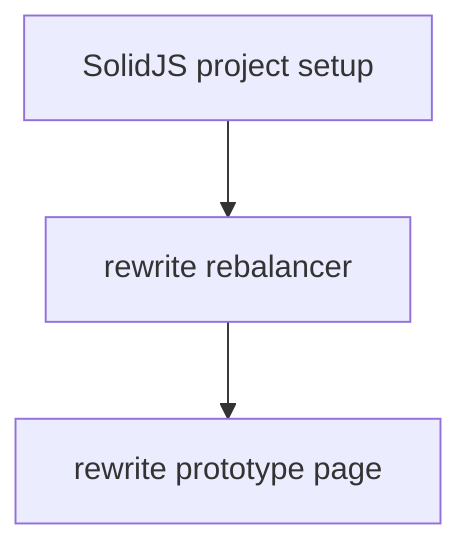

# Roadmap

> **Purpose**: Practical path from where we are today to the north star in
> [SPEC.md](./SPEC.md).

Each `##` section is an epic — a goal-oriented group of related issues. Epics
are ordered by priority (highest first).

---

## Frontend rewrite in SolidJS

React is slow, has a runtime, and AI tooling defaults to React patterns when it
sees `.jsx`. SolidJS compiles away the runtime, has cleaner reactivity, and
shadcn-solid provides the component library. Clean break — new SolidJS app
replaces the React frontend, using the old code as reference.

- [ ] SolidJS project setup (Nix, Vite, shadcn-solid, routing)
- [ ] Rewrite rebalancer page
- [ ] Rewrite prototype/design reference page

---

## Portfolio beta in frontend

The backend already computes portfolio-weighted beta (`POST /beta` takes weights
and benchmark, returns a single beta value). The frontend doesn't use it yet —
the rebalancer still shows raw net notional, which ignores correlations and
makes hedging guesswork.

- [ ] Fetch portfolio beta from backend (`POST /beta`)
- [ ] Display alongside net notional in rebalancer

---

## Risk analytics

> See SPEC.md: Analytics Capabilities > Risk Engine

Portfolio risk assessment beyond beta.

- [ ] Monte Carlo simulation of portfolio returns
- [ ] VaR/CVaR at configurable confidence levels
- [ ] Historical drawdown analysis
- [ ] Correlation matrix visualization

---

## Screener and staged trade simulation

> See SPEC.md: Core Workflow > Screen, Stage, Simulate

Find assets by factor characteristics and preview portfolio changes before
executing.

- [ ] Screener: rank assets by beta, momentum, carry, volatility
- [ ] Staged trades: add/remove positions, see simulated impact on risk metrics
- [ ] Compare staged vs current portfolio

---

## Spot trading

> See SPEC.md: Domain Architecture > Spot Trading

Unified perp + spot portfolio management.

- [ ] Hyperliquid spot integration
- [ ] Combined notional and weight calculations
- [ ] Single rebalance across both instrument types

---

## Not epic

These are directions we know matter but haven't designed:

- Options (Derive) for advanced risk management
- Tokenized equities (st0x) for TradFi factor exposure
- Yield products (Pendle)
- Multi-account support

---

## Completed: Backend foundation and portfolio beta

Rust backend with Rocket, Polars, CQRS/ES on SQLite. Ingestion pipeline fetches
OHLCV and funding rates from Hyperliquid, stores as CSV. Beta calculation
computes rolling covariance/variance against BTC. Deployed to DigitalOcean via
NixOS + deploy-rs.

- [x] Cargo workspace + Nix flake + CI/CD
- [x] Rocket HTTP server with health check
- [x] CQRS event store + Apalis job queue (SQLite)
- [x] Hyperliquid OHLCV ingestion (15m, 1h, 1d candles)
- [x] Funding rate ingestion
- [x] Rolling beta calculation (`POST /beta`)
- [x] Candle API (`GET /candles/<timeframe>`)
- [x] Ingestion status API (`GET /ingestion/status`)
