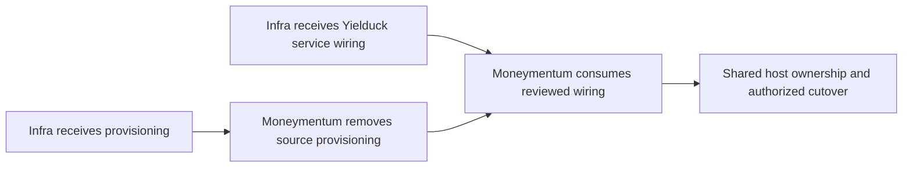

# Roadmap

[SPEC.md](./SPEC.md) describes the target system. This roadmap orders the work
by priority; GitHub issues hold requirements, acceptance criteria, and
sub-issues. Independent work can proceed in parallel. An open issue stays open
until its outcome is verified, even when supporting PRs have merged.

## See actual portfolio performance over time

Make the backend collect and serve the history needed to show portfolio value,
profit, and returns. The first useful result is a performance chart backed by
real portfolio observations, with cash flows distinguished from investment
performance and missing history shown explicitly.

- [ ] Replace performance placeholders with historical metrics and a chart --
      [#152](https://github.com/dataclique/moneymentum/issues/152).
- [ ] Resolve startup and ingestion failures that obstruct reliable data
      collection -- [#462](https://github.com/dataclique/moneymentum/issues/462)
      and [#452](https://github.com/dataclique/moneymentum/issues/452).
- [ ] Make historical drawdown available to the risk view --
      [#345](https://github.com/dataclique/moneymentum/issues/345) and
      [#209](https://github.com/dataclique/moneymentum/issues/209).
- [ ] Replace risk-panel mock values with the available backend metrics --
      [#351](https://github.com/dataclique/moneymentum/issues/351).

**Done when:** a selected period shows observed portfolio performance with
traceable valuations, cash flows, and data gaps. Historical market candles or
simulated portfolio returns alone do not satisfy this outcome.

## Construct portfolios around desired exposures and outcomes

Start with the desired portfolio: less BTC sensitivity, downside protection, or
momentum exposure without extra market beta. Compare instruments and
combinations by their effect on the whole portfolio, including cost and
constraints. Contract browsing supports that decision; it is not the product's
organizing workflow.

- [ ] Define portfolio-goal selection across instruments and combinations --
      [#495](https://github.com/dataclique/moneymentum/issues/495).
- [ ] Account for read-only BTC holdings and target ending BTC beta --
      [#317](https://github.com/dataclique/moneymentum/issues/317) and
      [#318](https://github.com/dataclique/moneymentum/issues/318).
- [ ] Include protective puts and Derive option positions in portfolio valuation
      and risk -- [#323](https://github.com/dataclique/moneymentum/issues/323),
      [#329](https://github.com/dataclique/moneymentum/issues/329), and
      [#204](https://github.com/dataclique/moneymentum/issues/204).
- [ ] Compare current and target allocations, screen by factor, and project
      staged portfolio metrics --
      [#330](https://github.com/dataclique/moneymentum/issues/330),
      [#332](https://github.com/dataclique/moneymentum/issues/332), and
      [#333](https://github.com/dataclique/moneymentum/issues/333).
- [ ] Compare historical crash scenarios, stressed correlations, and put rolls
      -- [#324](https://github.com/dataclique/moneymentum/issues/324),
      [#325](https://github.com/dataclique/moneymentum/issues/325), and
      [#326](https://github.com/dataclique/moneymentum/issues/326).
- [ ] Complete portfolio risk analytics --
      [#331](https://github.com/dataclique/moneymentum/issues/331).

**Done when:** users can compare feasible portfolio changes against an explicit
goal, see costs and residual exposure, and choose whether to stage and execute.
Estimates and unavailable projections remain visible; entering a goal never
submits trades automatically.

## Keep discretionary execution reliable

Fix genuine rebalance failures without making autonomous rebalancing the main
product direction. The user chooses when to execute; success must reflect venue
outcomes, not just submission.

- [ ] Detect completion and preserve recoverable partial or ambiguous outcomes
      -- [#92](https://github.com/dataclique/moneymentum/issues/92) and
      [#159](https://github.com/dataclique/moneymentum/issues/159).
- [ ] Support full close into cash using current account equity and positions --
      [#91](https://github.com/dataclique/moneymentum/issues/91) and
      [#463](https://github.com/dataclique/moneymentum/issues/463).
- [ ] Verify deployed long-short rebalancing under the existing test-account,
      funding-cap, and separate live-authorization contract --
      [#314](https://github.com/dataclique/moneymentum/issues/314).
- [ ] Make the portfolio desk usable by keyboard --
      [#457](https://github.com/dataclique/moneymentum/issues/457).

## Share one host through dataclique/infra

Move shared provisioning and host activation to
[Infra](https://github.com/dataclique/infra) for Moneymentum, Yielduck, and
Metagenda. Moneymentum retains its application package and service contract.
This preparation can proceed alongside the product work.

```mermaid
flowchart LR
    receiving["Infra receives provisioning"] --> removal["Moneymentum removes source provisioning"]
    service["Infra receives Yielduck service wiring"] --> consumer["Moneymentum consumes reviewed wiring"]
    removal --> consumer
    consumer --> cutover["Shared host ownership and authorized cutover"]
```

- [ ] Land receiving provisioning before source removal --
      [infra PR #2](https://github.com/dataclique/infra/pull/2) and
      [PR #490](https://github.com/dataclique/moneymentum/pull/490).
- [ ] Complete the paired Yielduck host integration --
      [#491](https://github.com/dataclique/moneymentum/issues/491),
      [infra PR #4](https://github.com/dataclique/infra/pull/4), and
      [PR #492](https://github.com/dataclique/moneymentum/pull/492).
- [ ] Transfer the remaining shared NixOS configuration and deployment ownership
      -- [infra #6](https://github.com/dataclique/infra/issues/6).
- [ ] Preserve reachability, domain access, atomic service activation, and
      recoverable candle backups --
      [#312](https://github.com/dataclique/moneymentum/issues/312),
      [#313](https://github.com/dataclique/moneymentum/issues/313),
      [#422](https://github.com/dataclique/moneymentum/issues/422), and
      [#450](https://github.com/dataclique/moneymentum/issues/450).

**Done when:** all three services run on the existing shared instance under
Infra-owned host configuration, with verified state isolation, recovery, and
rollback after an authorized cutover. The provisioning PR pair alone is a
partial migration.

## Extend portfolio coverage and ownership

Broaden the same portfolio model without creating separate instrument-specific
workflows.

- [ ] Add Hyperliquid spot and read-only wallets on other chains --
      [#334](https://github.com/dataclique/moneymentum/issues/334) and
      [#322](https://github.com/dataclique/moneymentum/issues/322).
- [ ] Establish Solana-public-key ownership, shareable portfolio URLs, and paid
      privacy -- [#319](https://github.com/dataclique/moneymentum/issues/319),
      [#320](https://github.com/dataclique/moneymentum/issues/320), and
      [#321](https://github.com/dataclique/moneymentum/issues/321).
- [ ] Synchronize encrypted local state --
      [#340](https://github.com/dataclique/moneymentum/issues/340).

## Managed vaults and commercialization

Let investors allocate to managed portfolios with explicit share accounting,
withdrawal behavior, and fees.

- [ ] Support vault deposits and withdrawals --
      [#327](https://github.com/dataclique/moneymentum/issues/327) and
      [#328](https://github.com/dataclique/moneymentum/issues/328).
- [ ] Make fee calculations transparent and define revenue buybacks --
      [#336](https://github.com/dataclique/moneymentum/issues/336) and
      [#335](https://github.com/dataclique/moneymentum/issues/335).
- [ ] Define governance and contribution bounties --
      [#337](https://github.com/dataclique/moneymentum/issues/337) and
      [#338](https://github.com/dataclique/moneymentum/issues/338).

## Not epic

Tokenized equities, yield products, and multi-account support remain exploration
directions in [SPEC.md](./SPEC.md), not scheduled work.

## Completed: portfolio and analytics foundations

Delivered work remains in the tracker and Git history rather than a second
implementation checklist here. Completion of a foundation does not imply its
dependent product experience is finished.

- [x] Deliver the basic screener, staging, leverage, submission, and draft
      portfolio contracts --
      [#305](https://github.com/dataclique/moneymentum/issues/305) through
      [#311](https://github.com/dataclique/moneymentum/issues/311).
- [x] Add active-portfolio BTC beta and read-only BTC addresses --
      [#315](https://github.com/dataclique/moneymentum/issues/315) and
      [#316](https://github.com/dataclique/moneymentum/issues/316).
- [x] Replace ingestion's singleton state with a run ledger --
      [#339](https://github.com/dataclique/moneymentum/issues/339).
- [x] Consolidate Rust factor analytics and the HTTP foundation --
      [#249](https://github.com/dataclique/moneymentum/issues/249),
      [#303](https://github.com/dataclique/moneymentum/issues/303), and
      [#397](https://github.com/dataclique/moneymentum/issues/397).

## Completed: planning refinement

- [x] Align performance, portfolio-construction, and shared-host priorities --
      [#493](https://github.com/dataclique/moneymentum/issues/493) /
      [PR #494](https://github.com/dataclique/moneymentum/pull/494).
