# Moneymentum Architecture Specification

**Status**: Draft
**Version**: 0.1.0
**Last Updated**: 2025-01-17

---

## Executive Summary

### Vision

Transform moneymentum from a momentum-based trading bot into an **institutional-grade quant toolkit for discretionary DeFi trading**. The core insight: traders should think in terms of factor exposures ("I want 30% momentum exposure with zero S&P beta") rather than individual asset positions.

### Key Capabilities

| Capability                              | Description                                                                               |
| --------------------------------------- | ----------------------------------------------------------------------------------------- |
| **Factor-first portfolio construction** | Rank/screen assets by factor loadings, build portfolios targeting specific exposures      |
| **Multi-instrument aggregation**        | All instruments on an underlying (spot, perps, options) roll up to show aggregated Greeks |
| **Real-time risk analytics**            | VaR, correlations, effective bets, stress testing                                         |
| **Sketch → Simulate → Execute**         | Stage changes, see factor impact, backtest, then execute                                  |

### Technology Stack

| Layer                 | Technology             | Rationale                                                      |
| --------------------- | ---------------------- | -------------------------------------------------------------- |
| Data Ingestion        | Python + CCXT          | Best exchange library ecosystem, async support                 |
| Analytics Engine      | Scala 2 + Apache Spark | Type-safe distributed computing, Frameless for typed datasets  |
| Domain Library        | Scala 3                | Modern type system, consumed by both Spark (via TASTy) and API |
| API Server            | Scala 3 + http4s       | Purely functional, composable, cats-effect ecosystem           |
| Storage               | Apache Iceberg         | Multi-engine, time travel, schema evolution, no vendor lock-in |
| Dependency Management | Nix                    | Reproducible builds across all languages                       |

### Core Architectural Principle

**Dual abstraction**: The system abstracts away both **data sources** and **execution venues**, allowing the trader to focus purely on desired exposures.

| Layer         | Abstraction               | Trader Thinks           | System Handles                                                                            |
| ------------- | ------------------------- | ----------------------- | ----------------------------------------------------------------------------------------- |
| **Data**      | Source-agnostic analytics | "What's my BTC beta?"   | Aggregating data from Hyperliquid, Deribit, Yahoo, etc.                                   |
| **Execution** | Venue-agnostic routing    | "I want +0.5 BTC delta" | Routing to correct venue (spot on Binance, perps on Hyperliquid, options on Derive, etc.) |

The trader expresses intent in terms of **exposures** (factors, Greeks, notional). The system determines:

1. Where to source data for analysis
2. Which instruments achieve the desired exposure
3. Which venues to execute on

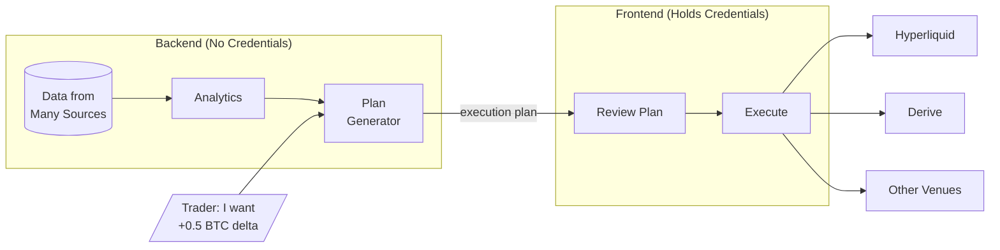

This means:

- Adding a new data source = one adapter, no analytics changes
- Adding a new execution venue = one adapter, no portfolio logic changes
- Trader never thinks about venue routing—system handles it transparently

---

## Table of Contents

1. [System Overview](#1-system-overview)
2. [Data Model](#2-data-model)
3. [Data Ingestion Layer](#3-data-ingestion-layer)
4. [Analytics Engine](#4-analytics-engine)
5. [Execution Layer](#5-execution-layer)
6. [API Layer](#6-api-layer)
7. [Technology Decisions](#7-technology-decisions)
8. [Scala 2/3 Interop Pattern](#8-scala-23-interop-pattern)
9. [Migration Strategy](#9-migration-strategy)

---

## 1. System Overview

### 1.1 High-Level Architecture

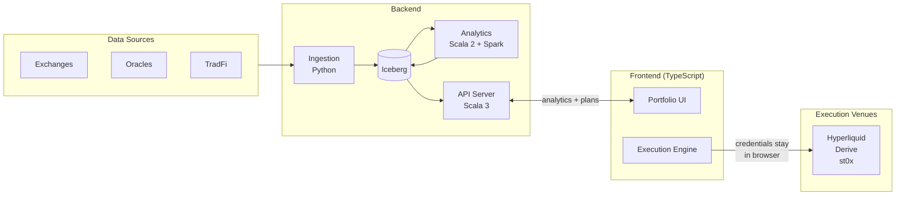

**Two main flows:**

1. **Data flow**: Sources → Ingestion → Iceberg → Analytics → API → Frontend
2. **Execution flow**: Frontend requests plan from API, then executes directly to venues (credentials never leave browser)

### 1.2 Module Boundaries

| Module       | Language   | Responsibility                                                         | Dependencies              |
| ------------ | ---------- | ---------------------------------------------------------------------- | ------------------------- |
| `ingestion/` | Python     | Thin CCXT wrappers for data fetching where no Scala alternative exists | CCXT, PyIceberg           |
| `shared/`    | Scala 3    | Domain types, pure calculation functions (Tldr), schemas               | cats-core, circe          |
| `analytics/` | Scala 2    | Spark jobs for factor/risk/Greeks computation                          | Spark, Frameless, shared  |
| `api/`       | Scala 3    | HTTP server: analytics, execution plan generation                      | http4s, shared            |
| `frontend/`  | TypeScript | UI + **execution engine** (venue adapters, order placement)            | React, CCXT-TS, ethers.js |

**Key architectural decisions:**

1. **Python minimization**: Python only for thin CCXT data wrappers. All business logic in Scala.
2. **Serverless execution**: Actual order placement happens in frontend. Backend generates plans but never touches credentials.
3. **Credential safety**: User credentials stay in browser storage. Zero backend liability.

### 1.3 Module Structure

```
quant-toolkit/
├── ingestion/                    # Thin Python CCXT wrappers (minimal)
│   ├── ccxt_bridge.py           # Fetch OHLCV, funding rates via CCXT
│   └── iceberg_writer.py        # Write to Iceberg tables
│
├── shared/                       # Scala 3 domain library
│   └── src/main/scala/
│       ├── domain/
│       │   ├── Instrument.scala # ADT: Spot, Perp, Option, LSD, PendlePT
│       │   ├── Position.scala
│       │   ├── Greeks.scala
│       │   ├── Factor.scala
│       │   └── Order.scala      # Order types for execution
│       ├── tldr/
│       │   └── Tldr.scala       # Pure function facade for Scala 2
│       └── schema/
│           └── Schemas.scala    # Avro schema definitions
│
├── analytics/                    # Scala 2 + Spark
│   └── src/main/scala/
│       ├── factors/
│       │   ├── BetaCalculator.scala
│       │   ├── MomentumCalculator.scala
│       │   └── CarryCalculator.scala
│       ├── greeks/
│       │   └── OptionsGreeks.scala
│       ├── risk/
│       │   ├── VaRCalculator.scala
│       │   ├── CorrelationMatrix.scala
│       │   └── StressTest.scala
│       └── jobs/
│           └── AnalyticsJob.scala
│
├── api/                          # Scala 3 + http4s
│   └── src/main/scala/
│       ├── routes/
│       │   ├── PortfolioRoutes.scala
│       │   ├── FactorRoutes.scala
│       │   ├── RiskRoutes.scala
│       │   ├── ScreenerRoutes.scala
│       │   └── PlanRoutes.scala       # Generate execution plans
│       ├── planner/
│       │   ├── ExecutionPlanner.scala # Plan generation logic
│       │   └── VenueSelector.scala    # Optimal venue selection
│       ├── streaming/
│       │   └── WebSocketHandler.scala
│       └── Server.scala
│
├── frontend/                     # React + TypeScript
│   └── src/
│       ├── execution/                 # Frontend execution engine
│       │   ├── adapters/
│       │   │   ├── VenueAdapter.ts    # Interface
│       │   │   ├── HyperliquidAdapter.ts
│       │   │   ├── DeriveAdapter.ts
│       │   │   └── St0xAdapter.ts
│       │   ├── ExecutionEngine.ts     # Execute plans
│       │   └── PositionAggregator.ts  # Unified position view
│       ├── pages/
│       ├── components/
│       └── ...
├── build.sbt
└── flake.nix
```

---

## 2. Data Model

### 2.1 Core Domain Types

#### Instrument Hierarchy

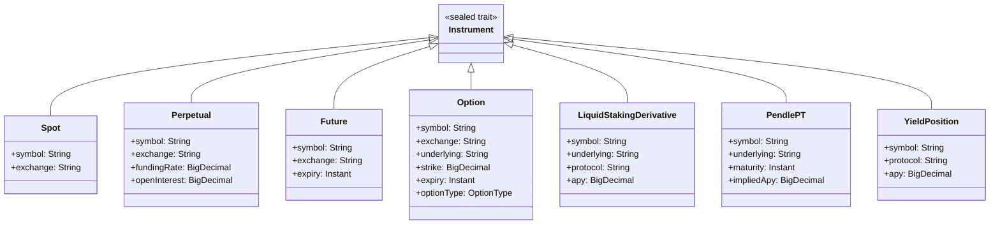

#### Position and Greeks

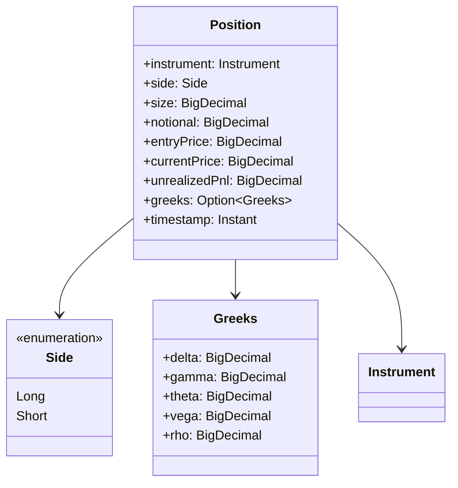

#### Factor Exposure and Risk

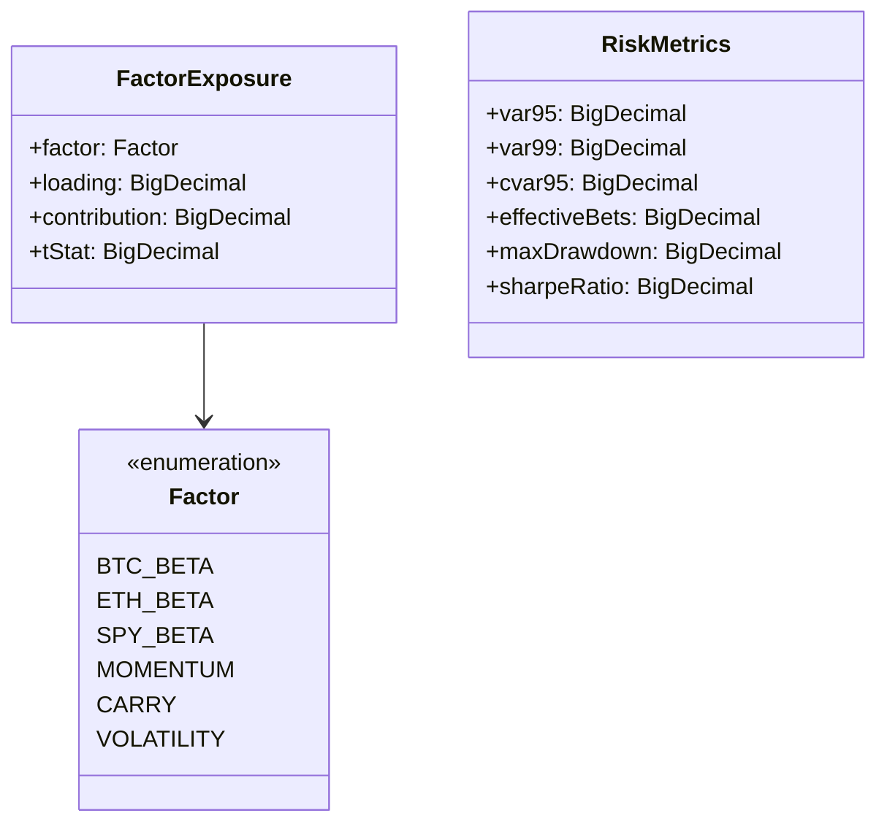

### 2.2 Iceberg Table Schemas

#### Raw Data Tables

| Table               | Partition                          | Description                    |
| ------------------- | ---------------------------------- | ------------------------------ |
| `raw.ohlcv`         | `exchange`, `date`                 | OHLCV candles from all sources |
| `raw.funding_rates` | `exchange`, `date`                 | Perpetual funding rates        |
| `raw.options_chain` | `exchange`, `underlying`, `expiry` | Options data                   |
| `raw.yields`        | `protocol`, `date`                 | DeFi yield data                |
| `raw.positions`     | `account`, `date`                  | Historical position snapshots  |

#### Computed Tables

| Table                       | Partition            | Description               |
| --------------------------- | -------------------- | ------------------------- |
| `computed.factor_exposures` | `date`               | Per-asset factor loadings |
| `computed.risk_metrics`     | `date`               | Portfolio risk metrics    |
| `computed.greeks`           | `date`, `underlying` | Options Greeks            |
| `computed.correlations`     | `date`               | Asset correlation matrix  |

### 2.3 Schema Example: OHLCV

```
ohlcv {
  exchange: string        # "hyperliquid", "binance", etc.
  symbol: string          # "BTC", "ETH", "SPY"
  instrument_type: string # "spot", "perpetual", "future"
  timestamp: timestamp_tz
  open: decimal(18, 8)
  high: decimal(18, 8)
  low: decimal(18, 8)
  close: decimal(18, 8)
  volume: decimal(18, 8)
  quote_volume: decimal(18, 8)

  # Metadata
  source: string          # Adapter that produced this record
  ingested_at: timestamp_tz
}
```

---

## 3. Data Ingestion Layer

### 3.1 Adapter Interface

Each data source implements a common interface:

```python
class DataSourceAdapter(Protocol):
    """Interface for all data source adapters."""

    @property
    def source_name(self) -> str:
        """Unique identifier for this source (e.g., 'hyperliquid', 'yahoo')."""
        ...

    async def fetch_ohlcv(
        self,
        symbols: list[str],
        timeframe: Timeframe,
        since: datetime | None = None,
    ) -> list[OHLCVRecord]:
        """Fetch OHLCV data, normalized to canonical schema."""
        ...

    async def fetch_funding_rates(
        self,
        symbols: list[str],
        since: datetime | None = None,
    ) -> list[FundingRateRecord]:
        """Fetch funding rates (for perpetuals)."""
        ...

    async def fetch_options_chain(
        self,
        underlyings: list[str],
    ) -> list[OptionsChainRecord]:
        """Fetch options chain (for options venues)."""
        ...
```

### 3.2 Planned Adapters

| Adapter               | Data Types                          | Priority                |
| --------------------- | ----------------------------------- | ----------------------- |
| `HyperliquidAdapter`  | OHLCV, funding rates, positions     | P0 (port from existing) |
| `YahooFinanceAdapter` | OHLCV for equities (SPY, TLT, etc.) | P0                      |
| `DeriveAdapter`       | Options chain, Greeks               | P1                      |
| `DeFiLlamaAdapter`    | Yield data, TVL                     | P1                      |
| `PythAdapter`         | Real-time prices                    | P2                      |

### 3.3 Ingestion Pipeline

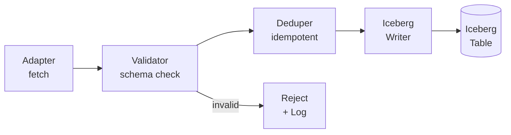

- **Validator**: Ensures records conform to schema, rejects malformed data
- **Deduper**: Prevents duplicate records (idempotent writes based on primary key)
- **Writer**: Appends to Iceberg tables with proper partitioning

---

## 4. Analytics Engine

### 4.1 Analytics Pipeline Overview

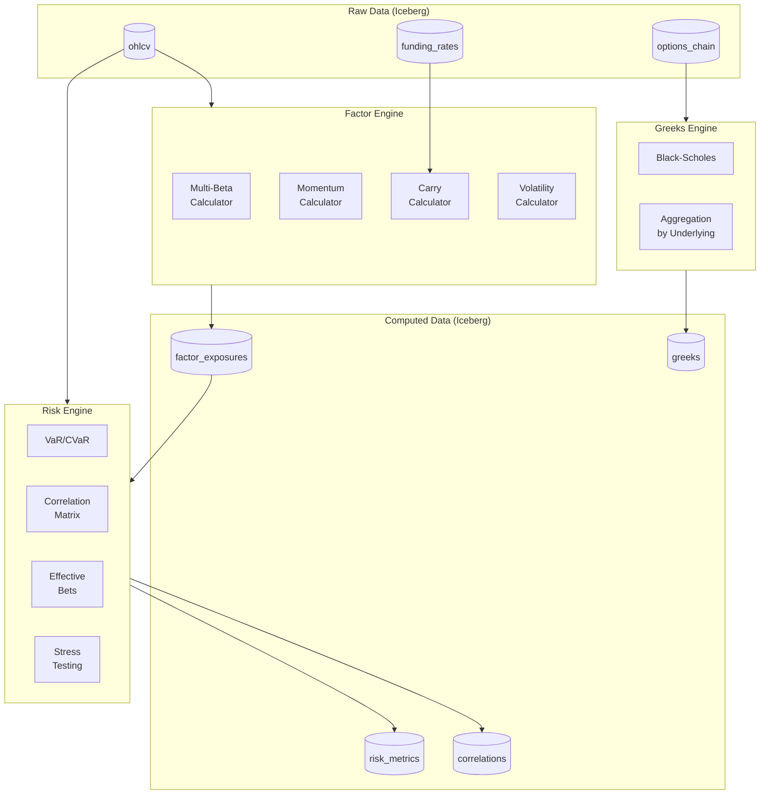

### 4.2 Factor Engine

#### Supported Factors

| Factor       | Calculation                   | Data Source   |
| ------------ | ----------------------------- | ------------- |
| `BTC_BETA`   | Cov(asset, BTC) / Var(BTC)    | OHLCV returns |
| `ETH_BETA`   | Cov(asset, ETH) / Var(ETH)    | OHLCV returns |
| `SPY_BETA`   | Cov(asset, SPY) / Var(SPY)    | OHLCV returns |
| `MOMENTUM`   | Autocorrelation of returns    | OHLCV returns |
| `CARRY`      | Annualized funding rate       | Funding rates |
| `VOLATILITY` | Annualized standard deviation | OHLCV returns |
| `VALUE`      | Price / 52-week high          | OHLCV prices  |

#### Factor Decomposition

For each asset and portfolio, compute:

- Factor loadings (regression coefficients)
- Factor contributions to return variance
- R-squared (explained variance)
- Residual (unexplained/idiosyncratic risk)

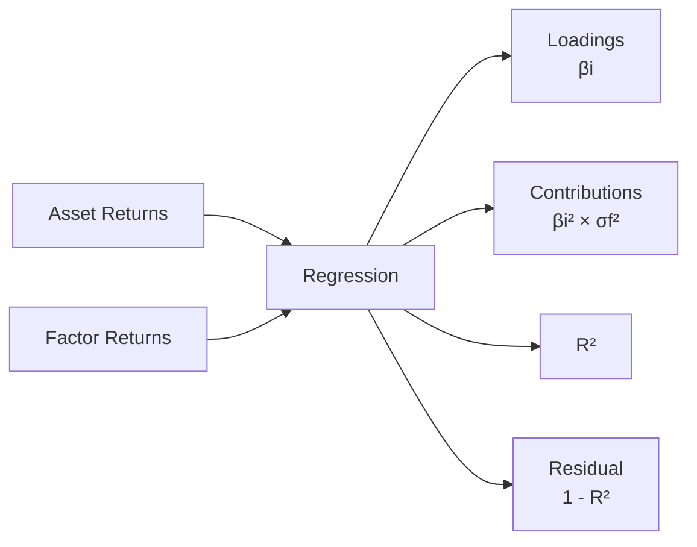

### 4.3 Risk Engine

#### VaR/CVaR Methods

| Method      | Description                      | Use Case                               |
| ----------- | -------------------------------- | -------------------------------------- |
| Historical  | Percentile of historical returns | Simple, no distribution assumptions    |
| Parametric  | Assumes normal, uses μ and σ     | Fast, works for normal-ish returns     |
| Monte Carlo | Simulate using factor model      | Captures fat tails, complex portfolios |

#### Correlation Matrix

- Rolling correlation between all assets
- Configurable lookback window (default: 30 days)
- Used for portfolio optimization and diversification analysis

#### Effective Number of Bets (ENB)

Measures true diversification accounting for correlations:

```
ENB = (Σ wi)² / Σ wi²  (simplified)

or with correlations:
ENB = 1 / Σᵢ Σⱼ (wi × wj × ρij × σi × σj) / σp²
```

#### Stress Testing

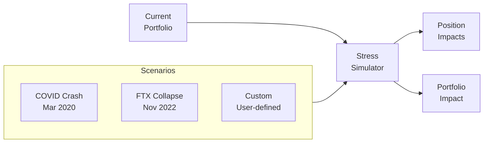

### 4.4 Greeks Engine

#### Per-Instrument Greeks

For options, calculate using Black-Scholes:

| Greek     | Definition | Interpretation                  |
| --------- | ---------- | ------------------------------- |
| Delta (Δ) | ∂V/∂S      | Price sensitivity to underlying |
| Gamma (Γ) | ∂²V/∂S²    | Delta sensitivity to underlying |
| Theta (Θ) | ∂V/∂t      | Time decay per day              |
| Vega (ν)  | ∂V/∂σ      | Sensitivity to volatility       |

#### Aggregation by Underlying

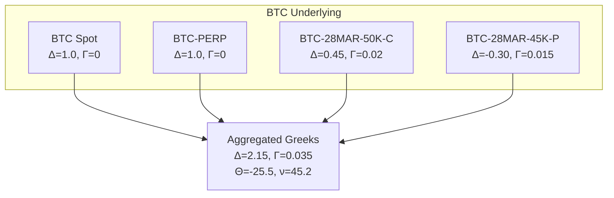

---

## 5. Execution Layer

### 5.1 Serverless Execution Model

**Critical security principle**: The backend never stores or handles user credentials. All actual order placement happens client-side. This eliminates credential storage liability entirely.

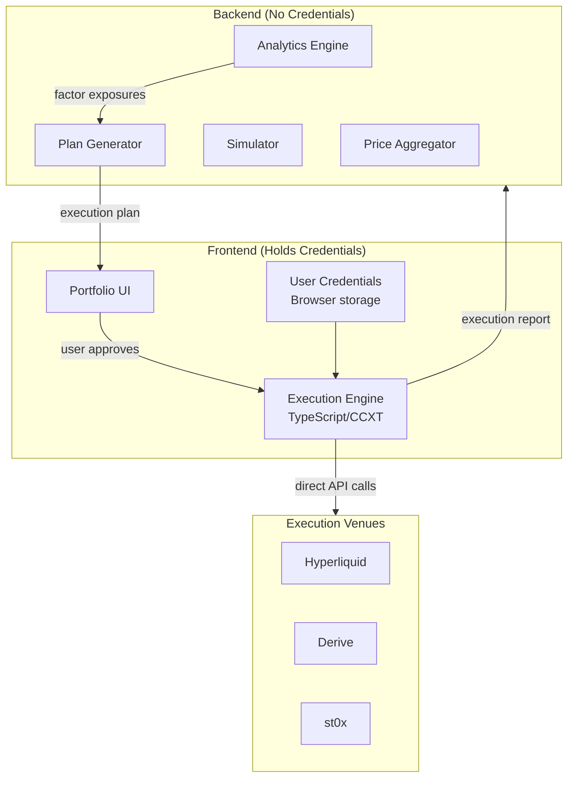

**Responsibility split:**

| Responsibility              | Location     | Rationale                              |
| --------------------------- | ------------ | -------------------------------------- |
| Data collection             | Backend      | Inefficient for each client to collect |
| Factor analysis             | Backend      | Computationally intensive              |
| Real-time price aggregation | Backend      | Single WebSocket serves all clients    |
| Simulation / backtesting    | Backend      | Requires historical data + compute     |
| Execution plan construction | Backend      | Needs analytics context                |
| **Actual order placement**  | **Frontend** | **Credentials stay client-side**       |
| Credential storage          | Frontend     | Zero backend liability                 |

### 5.2 Execution Plan

The backend produces an **execution plan**—a structured description of what trades to make—but does not execute them.

```typescript
interface ExecutionPlan {
  id: string
  createdAt: Timestamp
  targetExposure: FactorExposure[]
  orders: PlannedOrder[]
}

interface PlannedOrder {
  venue: "hyperliquid" | "derive" | "st0x" | ...
  instrument: Instrument
  side: "buy" | "sell"
  size: Decimal
  notional: Decimal
  rationale: string           // "Cheapest venue for BTC perp"
  estimatedCost: CostEstimate
  alternativeVenues?: AlternativeVenue[]
}
```

### 5.3 Frontend Execution Engine

The frontend receives execution plans and handles actual order placement:

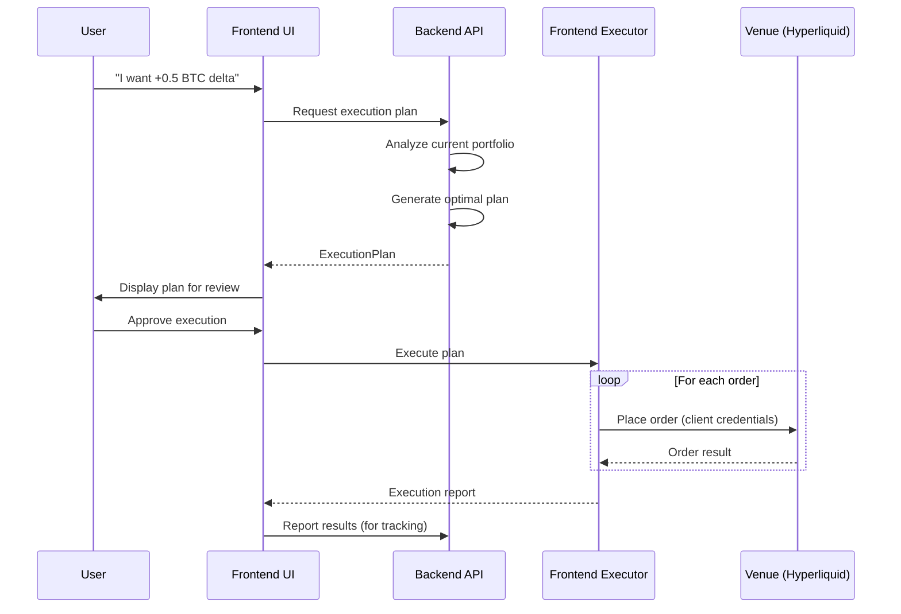

### 5.4 Venue Adapters (Frontend TypeScript)

```typescript
interface VenueAdapter {
  readonly venueName: string;
  readonly supportedInstruments: InstrumentType[];

  // Read operations
  getPositions(): Promise<Position[]>;
  getOrderBook(symbol: string): Promise<OrderBook>;

  // Write operations (credentials never leave browser)
  placeOrder(order: Order, credentials: Credentials): Promise<OrderResult>;
  cancelOrder(orderId: string, credentials: Credentials): Promise<void>;
}
```

Venue adapters implemented in TypeScript:

- **Hyperliquid**: CCXT TypeScript or direct REST/WebSocket
- **Derive**: ethers.js for on-chain execution
- **st0x**: Custom TypeScript SDK
- **Binance**: CCXT TypeScript

### 5.5 Instrument-to-Venue Routing

The backend plan generator uses this routing table:

| Instrument Type    | Primary Venue | Fallback | Selection Criteria      |
| ------------------ | ------------- | -------- | ----------------------- |
| Crypto Perps       | Hyperliquid   | Binance  | Funding rate, liquidity |
| Crypto Options     | Derive        | Deribit  | DeFi-native preferred   |
| Tokenized Equities | st0x          | —        | Single venue            |
| Crypto Spot        | Binance       | Kraken   | Liquidity, fees         |
| LSDs (stETH)       | Lido          | Curve    | Direct vs DEX           |

### 5.6 Execution Algorithms

For larger orders, the plan specifies an algorithm. The **frontend** implements these:

| Algorithm   | Description          | Frontend Behavior                   |
| ----------- | -------------------- | ----------------------------------- |
| **Market**  | Immediate execution  | Single order                        |
| **TWAP**    | Time-weighted slices | Frontend schedules orders over time |
| **Iceberg** | Hidden size          | Frontend places partial orders      |

### 5.7 Position Aggregation

Positions aggregated from multiple venues into unified view:

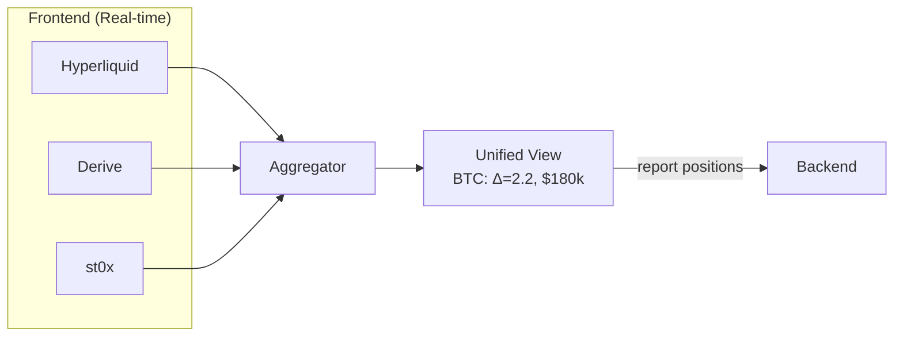

- **Real-time view**: Frontend aggregates directly from venues
- **Analytics**: Backend receives position reports for factor/risk calculations

---

## 6. API Layer

### 6.1 API Overview

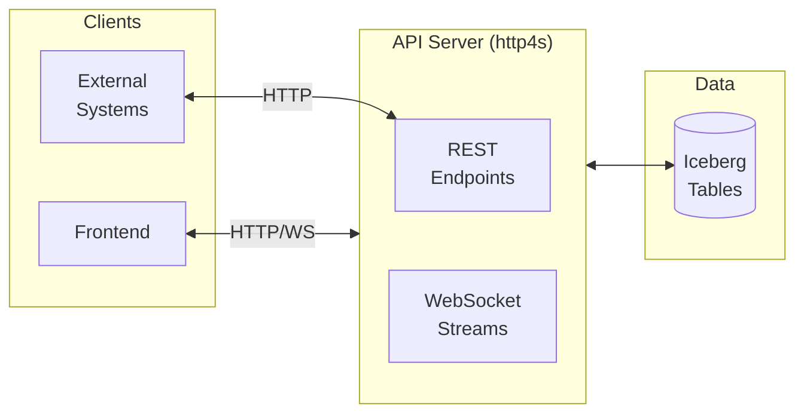

### 5.2 REST Endpoints

#### Portfolio

```
GET /api/v1/portfolio

Response:
{
  "totalValue": 1000000,
  "unrealizedPnl": 25000,
  "positions": [
    {
      "underlying": "BTC",
      "instruments": [
        {
          "symbol": "BTC-PERP",
          "type": "perpetual",
          "side": "long",
          "notional": 50000,
          "unrealizedPnl": 2500
        }
      ],
      "aggregatedGreeks": {
        "delta": 1.2,
        "gamma": 0.0,
        "theta": 0.0,
        "vega": 0.0
      }
    }
  ]
}
```

#### Factors

```
GET /api/v1/factors

Response:
{
  "exposures": [
    {"factor": "BTC_BETA", "loading": 0.85, "contribution": 0.45},
    {"factor": "ETH_BETA", "loading": 0.32, "contribution": 0.15},
    {"factor": "SPY_BETA", "loading": 0.12, "contribution": 0.05},
    {"factor": "MOMENTUM", "loading": 0.42, "contribution": 0.25},
    {"factor": "CARRY", "loading": -0.15, "contribution": -0.08}
  ],
  "decomposition": {
    "rSquared": 0.78,
    "residual": 0.22
  }
}
```

#### Risk

```
GET /api/v1/risk

Response:
{
  "var95": -0.032,
  "var99": -0.058,
  "cvar95": -0.045,
  "effectiveBets": 3.2,
  "maxDrawdown": -0.182,
  "sharpeRatio": 1.85
}
```

#### Correlations

```
GET /api/v1/correlations?assets=BTC,ETH,SOL,SPY&window=30

Response:
{
  "assets": ["BTC", "ETH", "SOL", "SPY"],
  "matrix": [
    [1.00, 0.85, 0.72, 0.35],
    [0.85, 1.00, 0.78, 0.32],
    [0.72, 0.78, 1.00, 0.28],
    [0.35, 0.32, 0.28, 1.00]
  ],
  "window": 30,
  "asOf": "2025-01-17T00:00:00Z"
}
```

#### Screener

```
GET /api/v1/screener?sortBy=momentum&order=desc&limit=20

Response:
{
  "assets": [
    {"symbol": "SOL", "momentum": 0.65, "btcBeta": 1.5, "carry": 0.02, "sharpe": 2.1},
    {"symbol": "AVAX", "momentum": 0.58, "btcBeta": 1.3, "carry": 0.01, "sharpe": 1.8}
  ]
}
```

#### Stress Test

```
POST /api/v1/simulate/stress-test

Request:
{
  "scenario": "CUSTOM",
  "shocks": {"BTC": -0.5, "ETH": -0.6, "SPY": -0.2}
}

Response:
{
  "portfolioImpact": -0.35,
  "positionImpacts": [
    {"symbol": "BTC-PERP", "impact": -0.5},
    {"symbol": "ETH-PERP", "impact": -0.6}
  ]
}
```

### 5.3 WebSocket Streams

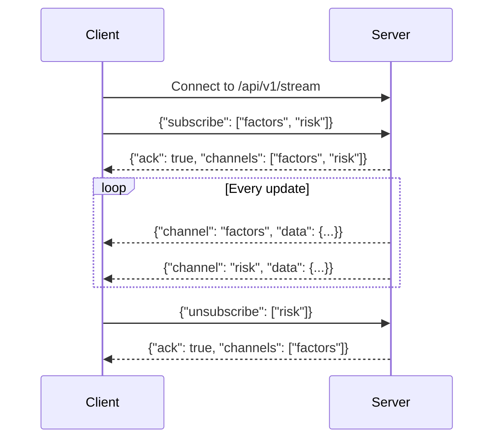

---

## 7. Technology Decisions

### 7.1 Why Python for Ingestion?

| Reason              | Details                                            |
| ------------------- | -------------------------------------------------- |
| **CCXT**            | Best-in-class exchange library with 100+ exchanges |
| **Async ecosystem** | asyncio, httpx for efficient concurrent fetching   |
| **PyIceberg**       | Native Iceberg support for writing tables          |
| **Existing code**   | Can port `yang/dataloader/` with minimal changes   |

### 7.2 Why Scala 2 for Spark Analytics?

| Reason                  | Details                                                        |
| ----------------------- | -------------------------------------------------------------- |
| **Spark compatibility** | Spark 3.x doesn't support Scala 3                              |
| **Frameless**           | Type-safe DataFrame operations, compile-time schema validation |
| **Performance**         | JVM optimizations, no Python serialization overhead            |
| **Type safety**         | Catch errors at compile time, not runtime                      |

### 7.3 Why Scala 3 for Domain Library and API?

| Reason                 | Details                                                  |
| ---------------------- | -------------------------------------------------------- |
| **Modern type system** | Union types, opaque types, proper enums                  |
| **Cleaner syntax**     | Significant whitespace, less boilerplate                 |
| **Interop**            | TASTy reader allows Scala 2 to consume Scala 3 libraries |
| **http4s ecosystem**   | Purely functional HTTP, cats-effect                      |

### 7.4 Why Apache Iceberg?

| Feature                 | Benefit                                             |
| ----------------------- | --------------------------------------------------- |
| **Time travel**         | Reproducible backtests against historical snapshots |
| **Schema evolution**    | Add columns without rewriting data                  |
| **Partition evolution** | Change partitioning strategy without migration      |
| **Multi-engine**        | Same tables readable by Spark, Trino, DuckDB        |
| **No vendor lock-in**   | Open specification, unlike Delta Lake               |

### 7.5 Why Nix?

| Reason                   | Details                                        |
| ------------------------ | ---------------------------------------------- |
| **Reproducibility**      | Same environment on every machine              |
| **Polyglot support**     | Manages Python, Scala, JDK, Spark in one flake |
| **CI/CD**                | Hermetic, cacheable builds                     |
| **Developer experience** | `direnv allow` and you're ready                |

---

## 8. Scala 2/3 Interop Pattern

### 8.1 The Challenge

- Spark 3.x only supports Scala 2.13
- We want domain types and business logic in Scala 3
- Analytics (Spark jobs) need to use domain logic

### 8.2 The Solution: Tldr Facade + TASTy Reader

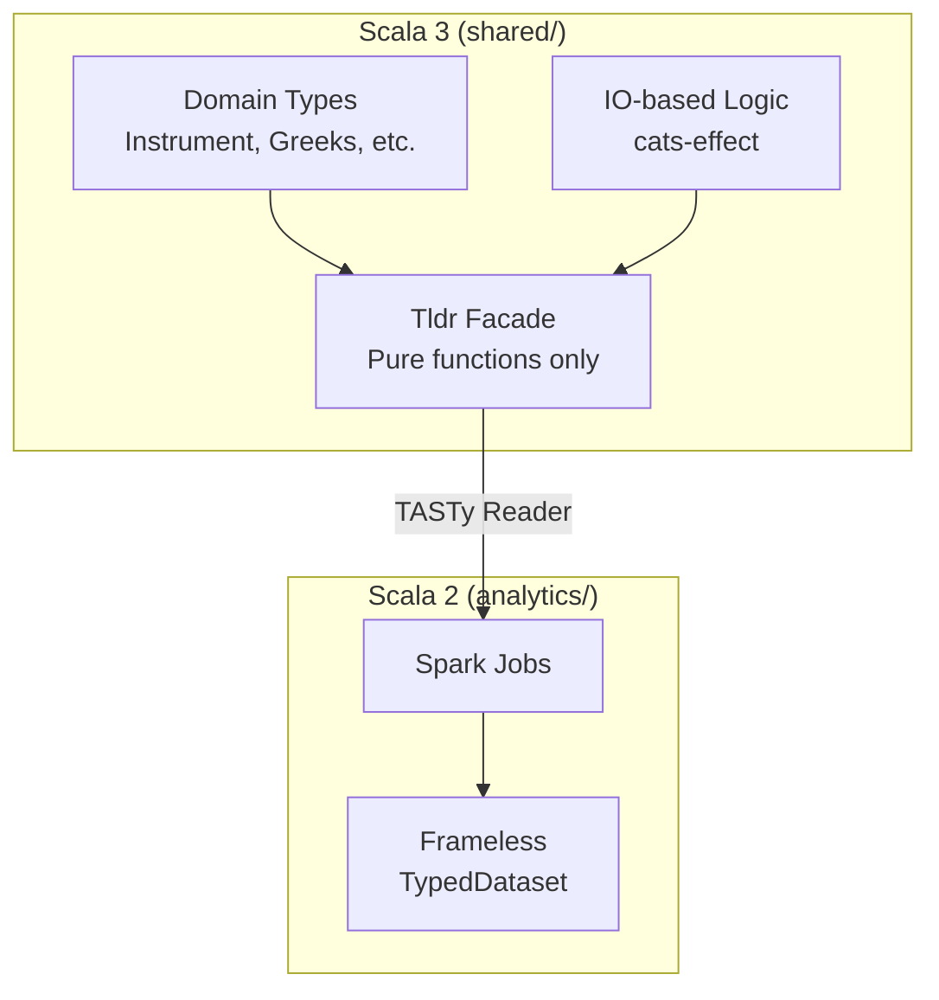

### 8.3 Tldr Facade Pattern

The Tldr object exposes pure functions with simple signatures that Scala 2 can consume:

```scala
// shared/src/main/scala/tldr/Tldr.scala (Scala 3)
object Tldr:
  /**
   * Calculate beta coefficient.
   * Hides internal IO/cats-effect complexity.
   */
  def calculateBeta(
    returns: Array[Double],
    benchmarkReturns: Array[Double]
  ): Option[Double] =
    // Internal implementation can use cats-effect
    val computation: IO[Either[Error, Double]] = ...
    computation
      .unsafeRunSync()(IORuntime.global)
      .toOption

  /**
   * Calculate Black-Scholes Greeks.
   */
  def blackScholesGreeks(
    spot: Double,
    strike: Double,
    timeToExpiry: Double,
    volatility: Double,
    riskFreeRate: Double,
    optionType: OptionType
  ): Option[Greeks] = ...
```

```scala
// analytics/src/main/scala/factors/BetaCalculator.scala (Scala 2)
// build.sbt: scalacOptions += "-Ytasty-reader"

import shared.tldr.Tldr

class BetaCalculator(spark: SparkSession) {
  import spark.implicits._

  def calculateBetas(
    returns: TypedDataset[AssetReturns],
    btcReturns: Array[Double]
  ): TypedDataset[AssetWithBeta] = {

    val betaUdf = udf((assetReturns: Array[Double]) =>
      Tldr.calculateBeta(assetReturns, btcReturns)
    )

    returns
      .withColumn("beta", betaUdf($"returns"))
      .as[AssetWithBeta]
  }
}
```

### 8.4 Build Configuration

```scala
// build.sbt

val Scala3 = "3.3.0"
val Scala2 = "2.13.11"

lazy val scala3Settings = Seq(
  scalaVersion := Scala3,
  scalacOptions ++= Seq("-feature", "-Werror")
)

lazy val scala2Settings = Seq(
  scalaVersion := Scala2,
  scalacOptions ++= Seq(
    "-Ytasty-reader",  // Enable reading Scala 3 TASTy files
    "-feature"
  )
)

// Shared domain library (Scala 3)
lazy val shared = (project in file("shared"))
  .settings(scala3Settings)
  .settings(
    libraryDependencies ++= Seq(
      "org.typelevel" %% "cats-core" % CatsVersion,
      "org.typelevel" %% "cats-effect" % CatsEffectVersion
    )
  )

// Analytics engine (Scala 2, consumes Scala 3 via TASTy)
lazy val analytics = (project in file("analytics"))
  .settings(scala2Settings)
  .settings(
    libraryDependencies ++= Seq(
      "org.apache.spark" %% "spark-sql" % SparkVersion % "provided",
      "org.typelevel" %% "frameless-dataset" % FramelessVersion
    ),
    // Shade transitive dependencies to avoid Spark conflicts
    assembly / assemblyShadeRules := Seq(
      ShadeRule.rename("shapeless.**" -> "shaded.shapeless.@1").inAll,
      ShadeRule.rename("cats.kernel.**" -> "shaded.cats.kernel.@1").inAll
    )
  )
  .dependsOn(shared)  // Scala 2 consuming Scala 3

// API server (Scala 3)
lazy val api = (project in file("api"))
  .settings(scala3Settings)
  .settings(
    libraryDependencies ++= Seq(
      "org.http4s" %% "http4s-ember-server" % Http4sVersion,
      "org.http4s" %% "http4s-circe" % Http4sVersion,
      "org.http4s" %% "http4s-dsl" % Http4sVersion
    )
  )
  .dependsOn(shared)
```

---

## 9. Migration Strategy

### 9.1 Current State

| Component         | Status     | Notes                                              |
| ----------------- | ---------- | -------------------------------------------------- |
| `/portfolio` page | **Active** | Serverless, talks to Hyperliquid directly via CCXT |
| PySpark analytics | Inactive   | `yang/chronos.py` not in production use            |
| FastAPI server    | Inactive   | Only serves backtest data                          |
| CSV storage       | Legacy     | Will be replaced by Iceberg                        |

### 9.2 Migration Approach: Clean Break

Since only `/portfolio` is in production use (and it's self-contained), we can rebuild everything else without disruption.

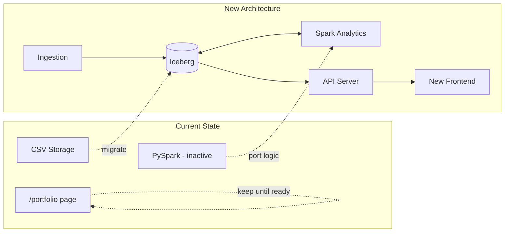

### 9.3 Phases

| Phase                 | Scope                               | Deliverable               | Dependencies |
| --------------------- | ----------------------------------- | ------------------------- | ------------ |
| **1. Foundation**     | Nix flake, SBT build, Iceberg setup | Dev environment ready     | None         |
| **2. Ingestion**      | Python adapters, Iceberg writers    | Data flowing to tables    | Phase 1      |
| **3. Shared Library** | Domain types, Tldr facade           | Type-safe foundation      | Phase 1      |
| **4. Analytics**      | Factor/risk/Greeks engines          | Computed tables populated | Phases 2, 3  |
| **5. API**            | http4s server, REST + WebSocket     | Backend serving data      | Phases 3, 4  |
| **6. Frontend**       | New analytics UI                    | Replace existing pages    | Phase 5      |

### 9.4 Constraints

- `/portfolio` page must remain functional until replacement is ready
- No changes to Hyperliquid execution until new system is proven
- Existing test data in `test_data/` should remain usable for validation

---

## Appendix A: Open Questions

| Question                  | Options                          | Impact                               |
| ------------------------- | -------------------------------- | ------------------------------------ |
| **Options pricing model** | Black-Scholes vs Heston vs SABR  | Greeks accuracy for exotic options   |
| **Analytics freshness**   | 15-min batch vs streaming        | Infrastructure complexity vs latency |
| **Historical retention**  | 1 year vs 5 years vs unlimited   | Storage cost vs backtest depth       |
| **Multi-account support** | Single portfolio vs sub-accounts | Data model complexity                |

---

## Appendix B: Glossary

| Term        | Definition                                                            |
| ----------- | --------------------------------------------------------------------- |
| **Factor**  | A systematic driver of returns (e.g., market beta, momentum)          |
| **Loading** | The coefficient/sensitivity of an asset to a factor                   |
| **Greeks**  | Sensitivities of option price to various parameters                   |
| **VaR**     | Value at Risk - maximum expected loss at a confidence level           |
| **CVaR**    | Conditional VaR - expected loss given that VaR is exceeded            |
| **ENB**     | Effective Number of Bets - diversification metric                     |
| **Tldr**    | "Too Long; Didn't Read" - facade pattern for simple function exposure |
| **TASTy**   | Typed Abstract Syntax Trees - Scala 3's intermediate representation   |
