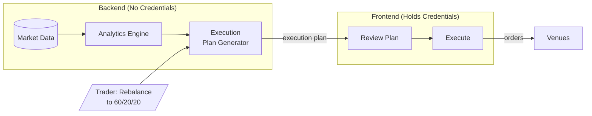

# Moneymentum Architecture Specification

---

## Terminology Standard

Use proper financial terminology throughout—docs, code, UI. It's precise,
expected by institutional traders, and avoids ambiguity. Define terms in context
when first introduced. The system should educate, not gate-keep or oversimplify.

---

## The Problem

A portfolio of 10 crypto assets looks diversified, but if they all move in
lockstep with BTC, you effectively have one bet. Professional traders think in
**factor exposures**—systematic drivers of returns like beta (correlation to a
benchmark), momentum (tendency of winners to keep winning), and carry (yield
from holding a position)—rather than individual positions. This lets them:

- **Reason about risk**: "What's my actual BTC exposure across spot and perps
  (perpetual futures) combined?"
- **Construct portfolios intentionally**: "I want momentum exposure without
  adding market beta"
- **Define targets as proportions**: "60% BTC beta, 20% high-momentum, 20%
  carry" rather than "2.5 BTC, 10 ETH, 50 SOL"

This tool provides factor-based screening, portfolio construction, risk
analytics, and simulation of changes before execution.

**Portfolios as proportions, not positions.** Professional portfolio managers
define targets as weights (40% asset A, 30% asset B, 30% asset C) and a leverage
multiplier (total exposure as a multiple of capital)—not as fixed position
sizes. This matters because:

- **Rebalancing has meaning**: When prices move, weights drift. Rebalancing
  means returning to target proportions, which is a deliberate risk management
  action.
- **Scaling is trivial**: Double your capital? Same weights, same risk profile.
  No need to recalculate position sizes.
- **Leverage is explicit**: Total exposure = NAV (net asset value) × leverage. A
  2x leveraged portfolio at 40/30/30 weights is immediately understandable.

The alternative—thinking in position sizes ("2.5 BTC, 10 ETH")—obscures risk.
Your weights change silently as prices move. "Rebalancing" becomes ambiguous.
This tool enforces proportion-based thinking.

---

## Core Workflow

**Monitor → Screen → Stage → Simulate → Execute → Repeat**

1. **Monitor**: Check how your portfolio is doing—performance, factor exposures,
   risk metrics
2. **Screen**: Search for positions based on what you want to change:
   - Direct exposure to specific assets
   - Beta to assets (BTC, ETH, SPY)
   - Funding rates (periodic payments between long and short holders in
     perps—positive = longs pay shorts)
   - Sharpe ratio (risk-adjusted return), volatility
3. **Stage**: Add/remove positions, adjust weights and leverage. Portfolio is
   defined as **proportions + leverage**, not dollar amounts
4. **Simulate**: Instantly see how staged portfolio compares to
   current—historical performance, factor decomposition, risk metrics, and the
   specific trades needed to rebalance
5. **Execute**: Hit rebalance when satisfied
6. **Repeat**: Market moves change your realized weights. Hit rebalance to
   return to target proportions, or adjust the target and rebalance to that

---

## Core Architectural Principle

**Dual abstraction**: The system abstracts away both **data sources** and
**execution venues**.

| Layer         | Trader Thinks            | System Handles                         |
| ------------- | ------------------------ | -------------------------------------- |
| **Data**      | "What's my BTC beta?"    | Aggregating data from multiple sources |
| **Execution** | "Rebalance to my target" | Routing orders to the correct venue    |

- Adding a new data source = one adapter, no analytics changes
- Adding a new execution venue = one adapter, no portfolio logic changes

---

## Security Model

**Backend never handles credentials.** All execution happens client-side.

- Backend pre-computes global market metrics (betas, correlations, etc.)
- Client provides portfolio-specific parameters in requests
- Backend returns user-specific analytics (portfolio beta, VaR, execution plans)
- Frontend holds credentials and executes orders directly to venues
- Credentials never leave the browser

---

## Technology Stack

| Layer        | Technology             | Rationale                                                      |
| ------------ | ---------------------- | -------------------------------------------------------------- |
| Backend      | Scala 2 + Spark + cats | See below.                                                     |
| Frontend     | TypeScript + React     | Execution engine lives here—credentials never leave browser.   |
| Dependencies | Nix                    | Reproducible builds across all environments. Non-negotiable.   |
| Storage      | TBD                    | Start simple, add Iceberg when historical analysis needs grow. |

**Why Scala?**

- Solid FP support for writing safe, robust, testable code—required for serious
  financial infrastructure
- Spark for heavy data analytics and simulations—required for a quantitative
  financial tool

Selection criteria: type safety, FP ecosystem maturity, Spark compatibility.
Scala fits all three.

**Why Scala 2?**

Spark requires Scala 2. We considered Scala 3 for the domain library and API
(better syntax, modern type system), but Scala 2/3 interop adds complexity for
marginal benefit. Single Scala 2 codebase is simpler.

---

## Domain Boundaries

| Domain               | Responsibility                                                                                       |
| -------------------- | ---------------------------------------------------------------------------------------------------- |
| **Data Ingestion**   | Fetch market data from venues, normalize to canonical schemas. Thin adapters with no business logic. |
| **Analytics Engine** | Factor calculations, risk metrics. All the math lives here.                                          |
| **Plan Generation**  | Given current portfolio and target, compute the trades needed to rebalance. Venue-agnostic.          |
| **Execution**        | Translate plans to venue-specific orders, sign transactions, submit. Lives in frontend.              |

---

## Analytics Capabilities

**Factor Engine**: Decompose returns into systematic factors

- Multi-asset beta (BTC, ETH, SPY)
- Momentum (autocorrelation—do past returns predict future returns?)
- Carry (funding rates)
- Volatility

**Risk Engine**: Portfolio-level risk metrics

- VaR/CVaR (Value at Risk: maximum expected loss at a confidence level;
  Conditional VaR: expected loss when VaR is exceeded)
- Correlation matrix
- Effective number of bets (true diversification accounting for correlations)
- Stress testing against historical scenarios

---

## Venue Support

**Starting point**: Hyperliquid (perps + spot)

Hyperliquid covers both perpetuals and spot trading, which unlocks significant
capability without venue complexity. The integration is abstracted cleanly so
additional venues can be added independently:

- Other perp venues
- Other spot venues
- Options venues (future)
- Tokenized equities (future)

---

## UI/UX Principles

**Keyboard-first, mouse-friendly.** Professional trading tools need speed. Power
users get vim-style and Bloomberg-style keyboard navigation—hjkl movement,
single-key actions, modal editing. But unlike vim, you shouldn't need to google
"how to quit" on day one. Everything is also clickable. Power comes from
learning the shortcuts, not from requiring them.

**Staged changes with instant feedback.** Never execute blind. Every portfolio
change is staged first, with immediate visualization of impact on factor
exposures, risk metrics, and the specific trades required. Commit when
satisfied.

---

## Future Directions

These are areas we know we want to explore but haven't designed in detail:

| Area                     | Notes                                                                                          |
| ------------------------ | ---------------------------------------------------------------------------------------------- |
| **Options**              | Advanced risk management. Greeks engine (price sensitivities). UI/UX, pricing, strategies TBD. |
| **Tokenized Equities**   | SPY (S&P 500), TLT (Treasury bonds) for factor hedging. Depends on st0x or similar.            |
| **Fixed Income / Yield** | Yield-bearing positions, staking.                                                              |
| **Multi-account**        | Sub-accounts with isolated risk but shared infrastructure.                                     |
