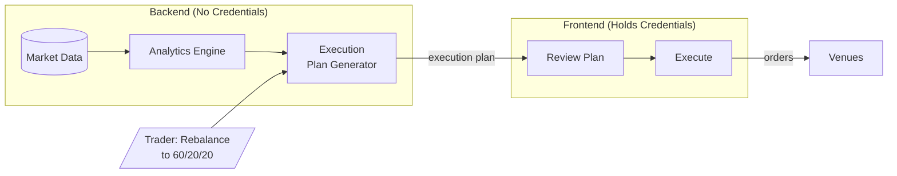

# Moneymentum Architecture Specification

---

## The Problem

A portfolio of 10 crypto assets looks diversified, but if they all move in lockstep with BTC, you effectively have one bet. Professional traders think in **factor exposures**—beta, momentum, carry—rather than individual positions. This lets them:

- **Reason about risk**: "What's my actual BTC exposure across spot and perps combined?"
- **Construct portfolios intentionally**: "I want momentum exposure without adding market beta"
- **Define targets as proportions**: "60% BTC beta, 20% high-momentum, 20% carry" rather than "2.5 BTC, 10 ETH, 50 SOL"

This tool provides factor-based screening, portfolio construction, risk analytics, and simulation of changes before execution.

---

## Core Workflow

**Monitor → Screen → Stage → Simulate → Execute → Repeat**

1. **Monitor**: Check how your portfolio is doing—performance, factor exposures, risk metrics
2. **Screen**: Search for positions based on what you want to change:
   - Direct exposure to specific assets
   - Beta to assets (BTC, ETH, SPY)
   - Funding rates (carry)
   - Sharpe ratio, volatility
3. **Stage**: Add/remove positions, adjust weights and leverage. Portfolio is defined as **proportions + leverage**, not dollar amounts
4. **Simulate**: Instantly see how staged portfolio compares to current—historical performance, factor decomposition, risk metrics, and the specific trades needed to rebalance
5. **Execute**: Hit rebalance when satisfied
6. **Repeat**: Market moves change your realized weights. Hit rebalance to return to target proportions, or adjust the target and rebalance to that

---

## Core Architectural Principle

**Dual abstraction**: The system abstracts away both **data sources** and **execution venues**.

| Layer         | Trader Thinks            | System Handles                         |
| ------------- | ------------------------ | -------------------------------------- |
| **Data**      | "What's my BTC beta?"    | Aggregating data from multiple sources |
| **Execution** | "Rebalance to my target" | Routing orders to the correct venue    |

- Adding a new data source = one adapter, no analytics changes
- Adding a new execution venue = one adapter, no portfolio logic changes

---

## Security Model

**Backend never handles credentials.** All execution happens client-side.

- Backend reads market data and chain state to track positions
- Backend generates execution plans (what trades to make)
- Frontend holds credentials and executes orders directly to venues
- Credentials never leave the browser

---

## Technology Stack

| Layer        | Technology             | Rationale                                                      |
| ------------ | ---------------------- | -------------------------------------------------------------- |
| Backend      | Scala 2 + Spark + cats | See below.                                                     |
| Frontend     | TypeScript + React     | Execution engine lives here—credentials never leave browser.   |
| Dependencies | Nix                    | Reproducible builds across all environments. Non-negotiable.   |
| Storage      | TBD                    | Start simple, add Iceberg when historical analysis needs grow. |

**Why Scala?**

- Solid FP support for writing safe, robust, testable code—required for serious financial infrastructure
- Spark for heavy data analytics and simulations—required for a quantitative financial tool

Rust if we needed efficiency in our own code. Haskell for the cleanest business logic DSL. Python if we hated ourselves and loved debugging at 3am. TypeScript for full-stack type coherence. None of those fit the project requirements as well as Scala.

**Why Scala 2?**

Spark requires Scala 2. We considered Scala 3 for the domain library and API (better syntax, modern type system), but Scala 2/3 interop adds complexity for marginal benefit. Single Scala 2 codebase is simpler.

---

## Domain Boundaries

| Domain               | Responsibility                                                                                       |
| -------------------- | ---------------------------------------------------------------------------------------------------- |
| **Data Ingestion**   | Fetch market data from venues, normalize to canonical schemas. Thin adapters with no business logic. |
| **Analytics Engine** | Factor calculations, risk metrics, Greeks computation. All the math lives here.                      |
| **Plan Generation**  | Given current portfolio and target, compute the trades needed to rebalance. Venue-agnostic.          |
| **Execution**        | Translate plans to venue-specific orders, sign transactions, submit. Lives in frontend.              |

---

## Analytics Capabilities

**Factor Engine**: Decompose returns into systematic factors

- Multi-asset beta (BTC, ETH, SPY)
- Momentum (return autocorrelation)
- Carry (funding rates)
- Volatility

**Risk Engine**: Portfolio-level risk metrics

- VaR/CVaR
- Correlation matrix
- Effective number of bets (true diversification accounting for correlations)
- Stress testing against historical scenarios

**Greeks Engine**: For instruments with optionality

- Per-instrument Greeks (delta, gamma, theta, vega)
- Aggregation by underlying across all instrument types

---

## Venue Support

**Starting point**: Hyperliquid (perps + spot)

Hyperliquid covers both perpetuals and spot trading, which unlocks significant capability without venue complexity. The integration is abstracted cleanly so additional venues can be added independently:

- Other perp venues
- Other spot venues
- Options venues (future)
- Tokenized equities (future)

---

## Future Directions

These are areas we know we want to explore but haven't designed in detail:

| Area                     | Notes                                                                                          |
| ------------------------ | ---------------------------------------------------------------------------------------------- |
| **Options**              | Important for advanced risk management. UI/UX, pricing models, and pre-bundled strategies TBD. |
| **Tokenized Equities**   | SPY, TLT exposure for factor hedging. Depends on st0x or similar.                              |
| **Fixed Income / Yield** | Pendle PT/YT, staking yields. Very early stage thinking.                                       |
| **Multi-account**        | Sub-accounts with isolated risk but shared infrastructure.                                     |
