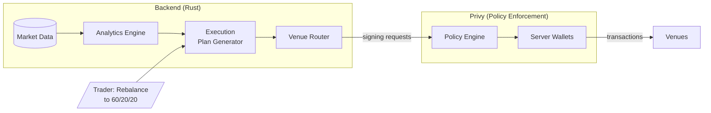
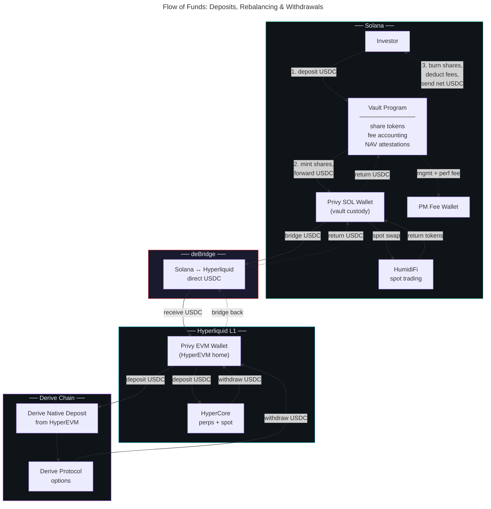

# Moneymentum Architecture Specification

## Terminology Standard

Use proper financial terminology throughout—docs, code, UI. It's precise,
expected by institutional traders, and avoids ambiguity. Define terms in context
when first introduced. The system should educate, not gate-keep or oversimplify.

## The Problem

A portfolio of 10 crypto assets looks diversified, but if they all move in
lockstep with BTC, you effectively have one bet. Professional traders think in
**factor exposures**—systematic drivers of returns like beta (correlation to a
benchmark), momentum (tendency of winners to keep winning), and carry (yield
from holding a position)—rather than individual positions. This lets them:

- **Reason about risk**: "What's my actual BTC exposure across spot and perps
  (perpetual futures) combined?"
- **Construct portfolios intentionally**: "I want momentum exposure without
  adding market beta"
- **Define targets as proportions**: "60% BTC beta, 20% high-momentum, 20%
  carry" rather than "2.5 BTC, 10 ETH, 50 SOL"

This tool provides factor-based screening, portfolio construction, risk
analytics, and simulation of changes before execution.

**Portfolios as proportions, not positions.** Professional portfolio managers
define targets as weights (40% asset A, 30% asset B, 30% asset C) and a leverage
multiplier (total exposure as a multiple of capital)—not as fixed position
sizes. This matters because:

- **Rebalancing has meaning**: When prices move, weights drift. Rebalancing
  means returning to target proportions, which is a deliberate risk management
  action.
- **Scaling is trivial**: Double your capital? Same weights, same risk profile.
  No need to recalculate position sizes.
- **Leverage is explicit**: Total exposure = NAV (net asset value) × leverage. A
  2x leveraged portfolio at 40/30/30 weights is immediately understandable.

The alternative—thinking in position sizes ("2.5 BTC, 10 ETH")—obscures risk.
Your weights change silently as prices move. "Rebalancing" becomes ambiguous.
This tool enforces proportion-based thinking.

## Core Workflow

**Monitor → Screen → Stage → Simulate → Execute → Repeat**

1. **Monitor**: Check how your portfolio is doing—performance, factor exposures,
   risk metrics
2. **Screen**: Search for positions based on what you want to change:
   - Direct exposure to specific assets
   - Beta to assets (BTC, ETH, SPY)
   - Funding rates (periodic payments between long and short holders in
     perps—positive = longs pay shorts)
   - Sharpe ratio (risk-adjusted return), volatility
3. **Stage**: Add/remove positions, adjust weights and leverage. Portfolio is
   defined as **proportions + leverage**, not dollar amounts
4. **Simulate**: Instantly see how staged portfolio compares to
   current—historical performance, factor decomposition, risk metrics, and the
   specific trades needed to rebalance
5. **Execute**: Hit rebalance when satisfied
6. **Repeat**: Market moves change your realized weights. Hit rebalance to
   return to target proportions, or adjust the target and rebalance to that

## Core Architectural Principle

**Dual abstraction**: The system abstracts away both **data sources** and
**execution venues**.

| Layer         | Trader Thinks            | System Handles                         |
| ------------- | ------------------------ | -------------------------------------- |
| **Data**      | "What's my BTC beta?"    | Aggregating data from multiple sources |
| **Execution** | "Rebalance to my target" | Routing orders to the correct venue    |

- Adding a new data source = one adapter, no analytics changes
- Adding a new execution venue = one adapter, no portfolio logic changes

## Security Model

**Policy-enforced custody via Privy server wallets.** The backend orchestrates
execution but never holds raw private keys.

- **Policy engine**: Contract allowlists, calldata restrictions, deny rules.
  Even if the backend is compromised, it cannot execute transactions outside
  policy bounds.
- **Credential separation**: Trading credentials are scoped to trade-only
  operations. Withdrawal credentials are held at a higher privilege tier.

The backend pre-computes global market metrics (betas, correlations, etc.) and
returns user-specific analytics (portfolio beta, VaR, execution plans). The
frontend is a monitoring and control dashboard.

## Custody & Execution

**Privy server wallets** provide the custody layer with policy enforcement at
the signing layer. The backend routes orders to venues but cannot withdraw funds
or interact with non-whitelisted contracts.

**Solana vault program** (Anchor) handles investor deposits/withdrawals, share
token accounting, and fee deductions. Capital flows from the vault to Privy
wallets for trading across venues.

**NAV oracle**: The backend aggregates positions across all venues, computes
total NAV, and posts signed attestations to the vault program.

## Fee Structure

Fees are the commercialization mechanism. Personal use is free (0/0 fees).
Revenue comes from PMs managing other people's money.

- **Management fee**: Annual percentage of AUM (assets under management),
  deducted at withdrawal
- **Performance fee**: Percentage of profits above high-water mark (HWM)—ensures
  fees only on new profits
- **Platform fee**: Percentage of PM's collected fees (not investor capital),
  creating aligned incentives

## Technology Stack

| Layer         | Technology           | Rationale                            |
| ------------- | -------------------- | ------------------------------------ |
| Backend       | Rust                 | See below.                           |
| Frontend      | TypeScript + React   | Monitoring dashboard, PM controls.   |
| Vault Program | Anchor (Rust)        | Deposits, withdrawals, fees, NAV.    |
| Custody       | Privy server wallets | Policy-enforced signing.             |
| Dependencies  | Nix                  | Reproducible builds. Non-negotiable. |
| Storage       | SQLite → Postgres    | Start simple, migrate when needed.   |

**Why Rust?**

- Official SDKs for Hyperliquid, Derive, deBridge, Jupiter—no client-building
- Polars for analytics—Rust-native DataFrames, no JVM overhead
- Alloy for HyperEVM, solana-sdk for Solana—transaction building in one language
- Single binary deployment, instant startup, minimal runtime dependencies
- Type safety and memory safety without garbage collector pauses

**Key crates:**

| Purpose   | Crate                                            |
| --------- | ------------------------------------------------ |
| API       | rocket                                           |
| Analytics | polars, linfa                                    |
| State     | cqrs-es                                          |
| EVM       | alloy                                            |
| Solana    | solana-sdk, anchor-client                        |
| Venues    | hyperliquid-rs, cockpit, jupiter-swap-api-client |
| DB        | sqlx                                             |
| Types     | ts-rs (TypeScript bindings)                      |

## Domain Architecture

**Bounded contexts:**

| Domain              | Responsibility                                          |
| ------------------- | ------------------------------------------------------- |
| **Portfolio**       | Target weights, current positions, NAV computation      |
| **Chain**           | Blockchain abstraction—tx formats, RPC, confirmations   |
| **Analytics**       | Factor exposures, risk metrics, correlations            |
| **Spot Trading**    | Buy/sell tokens on spot venues                          |
| **Perps Trading**   | Open/close perpetual futures positions                  |
| **Options Trading** | Options contracts, Greeks                               |
| **Bridging**        | Cross-chain asset transfers                             |
| **Signing**         | Transaction signing, policy enforcement                 |
| **Vault**           | Investor deposits, share tokens, fee accounting         |
| **Rebalancing**     | Orchestrate trades across venues/chains to reach target |

**Crate mapping:**

| Crate      | Trait          | Implementations                  |
| ---------- | -------------- | -------------------------------- |
| portfolio  | —              | —                                |
| chain      | `Chain`        | `solana`, `evm`, `mock`          |
| analytics  | `Analytics`    | `polars`, `mock`                 |
| spot       | `SpotVenue`    | `hyperliquid`, `jupiter`, `mock` |
| perps      | `PerpsVenue`   | `hyperliquid`, `mock`            |
| options    | `OptionsVenue` | `derive`, `mock`                 |
| bridging   | `Bridge`       | `debridge`, `mock`               |
| signing    | `Signer`       | `privy`, `mock`                  |
| vault      | `VaultClient`  | `anchor`, `mock`                 |
| rebalancer | —              | —                                |
| api        | —              | —                                |

Each crate exposes a trait and common types. Implementations are behind feature
flags (e.g., `spot/hyperliquid`, `spot/mock`) to enforce domain boundaries,
improve build times, and enable testing with mocks.

## Analytics Capabilities

**Factor Engine**: Decompose returns into systematic factors

- Multi-asset beta (BTC, ETH, SPY)
- Momentum (autocorrelation—do past returns predict future returns?)
- Carry (funding rates)
- Volatility

**Risk Engine**: Portfolio-level risk metrics

- VaR/CVaR (Value at Risk: maximum expected loss at a confidence level;
  Conditional VaR: expected loss when VaR is exceeded)
- Correlation matrix
- Effective number of bets (true diversification accounting for correlations)
- Stress testing against historical scenarios

## UI/UX Principles

**Keyboard-first, mouse-friendly.** Professional trading tools need speed. Power
users get vim-style and Bloomberg-style keyboard navigation—hjkl movement,
single-key actions, modal editing. But unlike vim, you shouldn't need to google
"how to quit" on day one. Everything is also clickable. Power comes from
learning the shortcuts, not from requiring them.

**Staged changes with instant feedback.** Never execute blind. Every portfolio
change is staged first, with immediate visualization of impact on factor
exposures, risk metrics, and the specific trades required. Commit when
satisfied.

## Future Directions

These are areas we know we want to explore but haven't designed in detail:

| Area                     | Notes                                 |
| ------------------------ | ------------------------------------- |
| **Tokenized Equities**   | SPY, TLT for factor hedging.          |
| **Fixed Income / Yield** | Yield-bearing positions, staking.     |
| **Multi-account**        | Isolated risk, shared infrastructure. |
