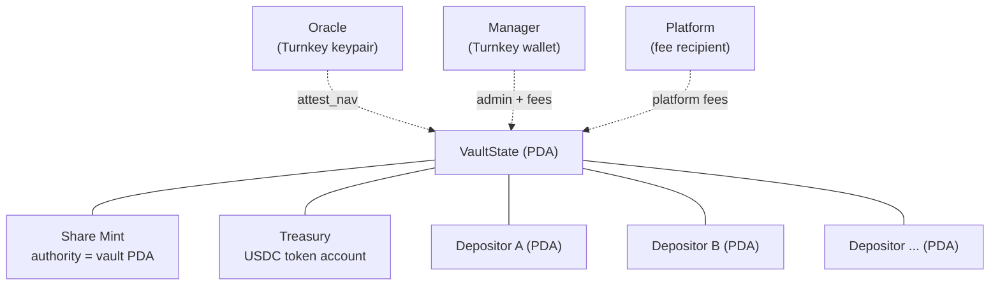
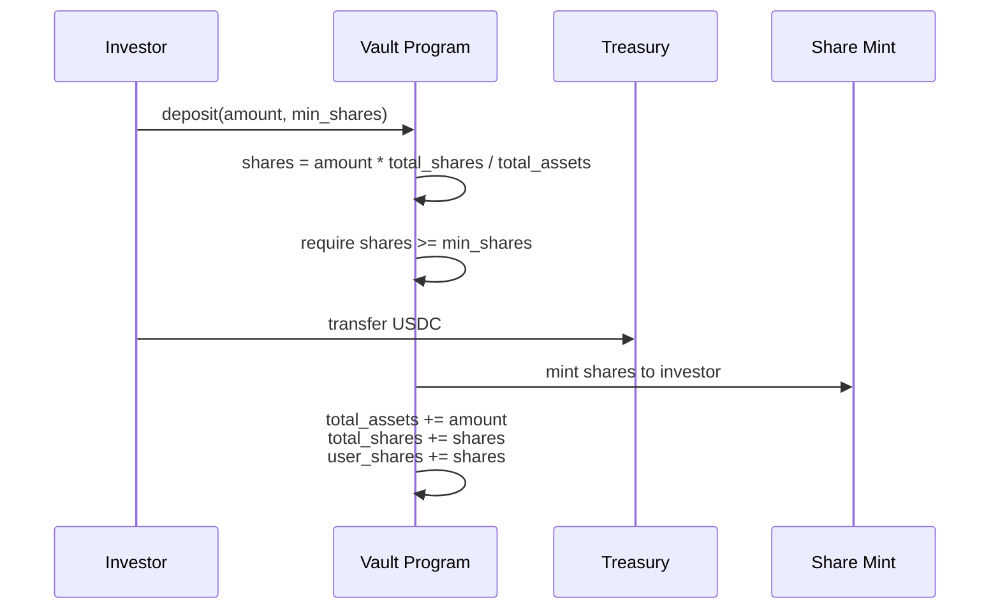
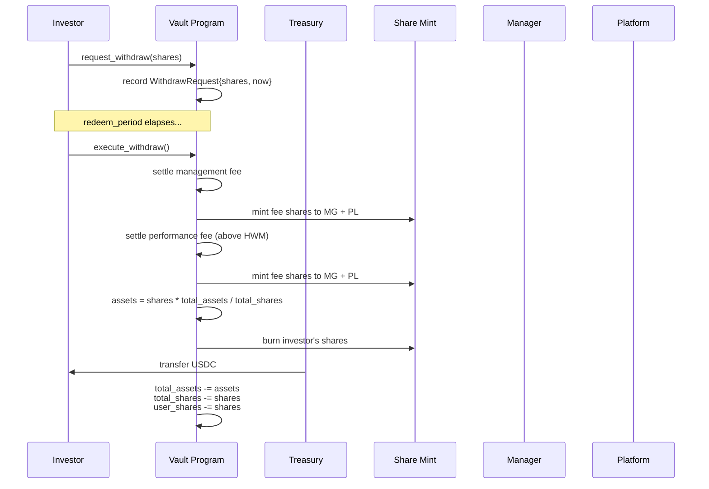
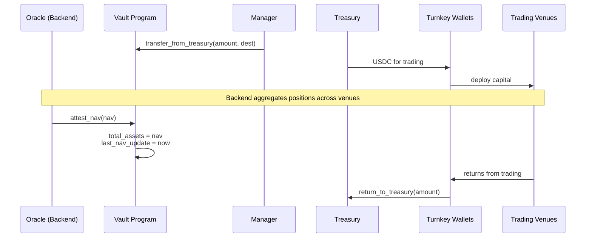
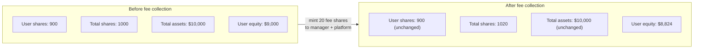

# Solana Vault Program Specification

On-chain vault for investor deposits, share token accounting, fee collection,
and NAV attestation. Built with Anchor. Denominated in USDC.

## Why a vault

The backend orchestrates trading across Hyperliquid, Derive, and Solana spot
venues. Investors deposit USDC into the vault and receive share tokens
representing proportional ownership. The vault program is the on-chain source of
truth for who owns what. Capital flows out of the vault into Turnkey-controlled
wallets for cross-venue trading, and flows back in when positions are closed.

The vault does **not** execute trades or hold positions directly. It holds idle
USDC and tracks total NAV via oracle attestations from the backend.

## Account relationships



## Accounts

### VaultState (PDA)

Central configuration and accounting. One per vault instance.

```
seeds: [b"vault", underlying_mint]
```

| Field                 | Type     | Description                                          |
| --------------------- | -------- | ---------------------------------------------------- |
| `underlying_mint`     | `Pubkey` | USDC mint address                                    |
| `share_mint`          | `Pubkey` | Share token mint (authority = vault PDA)             |
| `treasury`            | `Pubkey` | Vault's USDC token account                           |
| `total_assets`        | `u64`    | Tracked internally (not token account balance)       |
| `total_shares`        | `u64`    | All shares including manager/protocol shares         |
| `user_shares`         | `u64`    | Shares belonging to depositors (excludes fee shares) |
| `oracle`              | `Pubkey` | Authorized NAV attestation signer                    |
| `manager`             | `Pubkey` | Portfolio manager (fee recipient, vault admin)       |
| `management_fee_bps`  | `u16`    | Annual management fee in basis points (max 1000)     |
| `performance_fee_bps` | `u16`    | Performance fee in basis points (max 5000)           |
| `platform_fee_bps`    | `u16`    | Platform cut of PM fees in basis points              |
| `platform`            | `Pubkey` | Platform fee recipient                               |
| `redeem_period`       | `i64`    | Seconds between withdrawal request and execution     |
| `last_nav_update`     | `i64`    | Unix timestamp of most recent NAV attestation        |
| `deposits_paused`     | `bool`   | Emergency pause                                      |
| `withdrawals_paused`  | `bool`   | Emergency pause                                      |
| `bump`                | `u8`     | PDA bump seed                                        |

### Depositor (PDA)

Per-user accounting. Tracks individual share ownership, high-water mark for
performance fees, and pending withdrawal requests.

```
seeds: [b"depositor", vault, user_wallet]
```

| Field                     | Type                      | Description                                            |
| ------------------------- | ------------------------- | ------------------------------------------------------ |
| `vault`                   | `Pubkey`                  | Parent vault                                           |
| `authority`               | `Pubkey`                  | User wallet                                            |
| `vault_shares`            | `u64`                     | User's share balance                                   |
| `net_deposits`            | `i64`                     | Cumulative deposits minus withdrawals (USDC)           |
| `cumulative_profit_share` | `u64`                     | Total performance fees paid (prevents double-charging) |
| `last_withdraw_request`   | `Option<WithdrawRequest>` | Pending two-phase withdrawal                           |
| `last_fee_settle`         | `i64`                     | Timestamp of last fee settlement                       |
| `bump`                    | `u8`                      | PDA bump seed                                          |

### WithdrawRequest

Embedded in `Depositor`. Tracks a pending withdrawal between request and
execution.

| Field          | Type  | Description                |
| -------------- | ----- | -------------------------- |
| `shares`       | `u64` | Number of shares to redeem |
| `requested_at` | `i64` | Unix timestamp of request  |

## Token choices

**Share token**: Classic SPL Token. Share tokens are internal accounting -- they
don't need transfer hooks, confidential transfers, or fee extensions. Classic
SPL has universal wallet and DeFi integration.

**Underlying token**: USDC on Solana.

| Property | Value                                          |
| -------- | ---------------------------------------------- |
| Mint     | `EPjFWdd5AufqSSqeM2qN1xzybapC8G4wEGGkZwyTDt1v` |
| Decimals | 6                                              |
| Program  | Classic SPL Token                              |

`1 USDC = 1_000_000` in raw token amounts. All arithmetic uses 6-decimal
precision.

## Deposit flow



## Withdrawal flow



## NAV attestation and capital deployment



## Fee collection via share dilution



## Instructions

### `initialize_vault`

Creates the vault, share mint, and treasury token account. The share mint's
authority is the vault PDA. Mints `VIRTUAL_SHARES` (1,000,000) to a dead address
to prevent inflation attacks.

**Signers**: manager

**Params**:

- `management_fee_bps: u16`
- `performance_fee_bps: u16`
- `platform_fee_bps: u16`
- `redeem_period: i64`

### `deposit`

Transfers USDC from user to treasury. Mints share tokens to user's associated
token account. Creates `Depositor` PDA on first deposit.

**Signers**: depositor

**Params**:

- `amount: u64` -- USDC amount (6 decimals)
- `min_shares: u64` -- slippage protection

**Share calculation**:

```
shares = (amount * (total_shares + VIRTUAL_SHARES)) / (total_assets + VIRTUAL_ASSETS)
```

Floor division (rounds down) -- favors the vault.

**State updates**:

- `total_assets += amount`
- `total_shares += shares`
- `user_shares += shares`
- `depositor.vault_shares += shares`
- `depositor.net_deposits += amount as i64`

**Guards**:

- `!deposits_paused`
- `amount > 0`
- `shares >= min_shares`

### `request_withdraw`

Records a withdrawal request on the `Depositor` account. Does not move tokens.

**Signers**: depositor

**Params**:

- `shares: u64` -- number of shares to redeem

**Guards**:

- `!withdrawals_paused`
- `shares > 0`
- `shares <= depositor.vault_shares`
- `depositor.last_withdraw_request.is_none()` (one pending request at a time)

### `execute_withdraw`

Settles a pending withdrawal request after the redeem period has elapsed. Burns
shares, settles fees, transfers net USDC to user.

**Signers**: depositor

**Flow**:

1. Verify `redeem_period` has elapsed since `requested_at`
2. Settle management fee (see [Fee collection](#fee-collection))
3. Settle performance fee (see [Fee collection](#fee-collection))
4. Calculate USDC owed: `assets = (shares * total_assets) / total_shares`
   (floor)
5. Verify treasury has sufficient USDC
6. Burn shares from user's token account
7. Transfer USDC from treasury to user
8. Clear `last_withdraw_request`

**State updates**:

- `total_assets -= assets`
- `total_shares -= shares` (after fee shares minted)
- `user_shares -= shares`
- `depositor.vault_shares -= shares`
- `depositor.net_deposits -= assets as i64`

### `attest_nav`

Oracle submits the current total NAV (value of all assets across all venues).
This is the only way `total_assets` changes outside of deposits/withdrawals.

**Signers**: oracle

**Params**:

- `nav: u64` -- total vault NAV in USDC (6 decimals)

**State updates**:

- `total_assets = nav`
- `last_nav_update = Clock::get()?.unix_timestamp`

**Guards**:

- `signer == vault.oracle`

NAV can go up (trading profits) or down (trading losses). There is no cap on NAV
change magnitude -- the oracle is a trusted backend service. If the oracle key
is compromised, the manager can pause withdrawals and rotate the oracle.

### `pause_deposits` / `resume_deposits`

**Signers**: manager

### `pause_withdrawals` / `resume_withdrawals`

**Signers**: manager

### `update_oracle`

Rotates the oracle authority.

**Signers**: manager

**Params**:

- `new_oracle: Pubkey`

### `transfer_from_treasury`

Moves USDC from treasury to an external wallet (Turnkey-controlled) for trading.
Only the manager can authorize this.

**Signers**: manager

**Params**:

- `amount: u64`
- `destination: Pubkey` -- must be a USDC token account

**State updates**:

- None. `total_assets` is managed solely by `attest_nav` and deposit/withdraw
  flows. Treasury balance and total assets are intentionally decoupled -- the
  vault may hold less USDC than `total_assets` because capital is deployed
  across venues.

### `return_to_treasury`

Returns USDC to the treasury from an external wallet. Anyone can call this (it's
a deposit into the vault's token account, not a user deposit for shares).

**Params**:

- `amount: u64`

## Fee collection

Fees are collected via **share dilution**. New shares are minted to the manager
(and platform), increasing `total_shares` while `user_shares` stays constant.
This proportionally reduces each depositor's equity claim without any token
transfers at fee collection time.

### Management fee

Annual percentage of depositor's equity, accrued continuously based on elapsed
time.

```
elapsed = now - depositor.last_fee_settle
depositor_equity = (depositor.vault_shares * total_assets) / total_shares
fee_amount = depositor_equity * management_fee_bps * elapsed / (10_000 * SECONDS_PER_YEAR)
```

`SECONDS_PER_YEAR = 31_557_600` (365.25 days).

Convert `fee_amount` to shares:
`fee_shares = (fee_amount * total_shares) / total_assets`

Split between manager and platform:

- `platform_share = fee_shares * platform_fee_bps / 10_000`
- `manager_share = fee_shares - platform_share`

Mint `manager_share` to manager, `platform_share` to platform.

Collected on every `execute_withdraw`. Not collected on deposit (depositors
shouldn't pay fees on money that hasn't been managed yet).

### Performance fee

Percentage of profits above the depositor's cost basis (high-water mark).

```
depositor_equity = (depositor.vault_shares * total_assets) / total_shares
cost_basis = depositor.net_deposits + depositor.cumulative_profit_share
profit = depositor_equity - cost_basis  (if positive, else 0)
fee_amount = profit * performance_fee_bps / 10_000
```

Same share dilution and platform split as management fee.

`depositor.cumulative_profit_share += fee_amount` prevents double-charging on
the same profits.

**HWM adjustment on new deposits**: When a user deposits while their equity is
below cost basis (underwater), `net_deposits` increases, raising the cost basis
further. This means the manager only earns performance fees once the total
equity exceeds all-time high -- new deposits don't reset the watermark.

### Fee parameter bounds

| Parameter             | Min | Max   |
| --------------------- | --- | ----- |
| `management_fee_bps`  | 0   | 1000  |
| `performance_fee_bps` | 0   | 5000  |
| `platform_fee_bps`    | 0   | 10000 |

## Share price manipulation prevention

### Inflation attack

An attacker deposits 1 unit, donates a large amount directly to the treasury,
then the next depositor's shares round to zero.

**Mitigations** (both applied):

1. **Internal balance tracking**: `total_assets` is a field in `VaultState`,
   updated only through `deposit`, `execute_withdraw`, and `attest_nav`. Direct
   token transfers to the treasury are ignored. This makes donation attacks
   impossible.

2. **Virtual shares and assets**: The share conversion formula includes
   constants that bound the exchange rate when the vault is near-empty:
   ```
   VIRTUAL_SHARES = 1_000_000  (10^6, matching USDC decimals)
   VIRTUAL_ASSETS = 1          (1 unit of USDC = 0.000001 USDC)
   ```

### Frontrunning NAV updates

An attacker sees a pending `attest_nav` transaction and deposits just before a
favorable NAV increase, then withdraws immediately after.

**Mitigations**:

- Two-phase withdrawal with `redeem_period` delay
- NAV updates don't affect existing depositors' entry prices (no instant
  arbitrage opportunity for new deposits because management/performance fees
  erode any gain)
- Slippage protection (`min_shares` on deposits)

## Arithmetic rules

All share/fee calculations use `u128` intermediaries with checked arithmetic.

| Rule                                                                       | Rationale                                                                  |
| -------------------------------------------------------------------------- | -------------------------------------------------------------------------- |
| Multiply before divide                                                     | Preserves precision                                                        |
| Floor division for payouts (shares from deposits, assets from withdrawals) | Favors the vault                                                           |
| Ceiling division for fees                                                  | Favors the fee recipient                                                   |
| `checked_add`, `checked_mul`, `checked_div`, `checked_sub` everywhere      | Panics on overflow in debug, wraps in release -- use checked to catch both |
| `overflow-checks = true` in `[profile.release]`                            | Belt and suspenders                                                        |
| No floating point                                                          | Deterministic, no precision loss                                           |

## Account validation

| Check                         | Mechanism                                           |
| ----------------------------- | --------------------------------------------------- |
| Ownership                     | Anchor `Account<'info, T>`                          |
| Signer                        | `Signer<'info>`                                     |
| PDA seeds                     | `#[account(seeds = [...], bump)]`                   |
| Authority                     | `#[account(has_one = authority)]` or `constraint =` |
| No duplicate mutable accounts | `constraint = a.key() != b.key()`                   |
| Post-CPI reload               | `account.reload()?` after `invoke_signed`           |

## Program architecture

```
programs/vault/
  src/
    lib.rs          -- program entrypoint, instruction dispatch
    vault.rs        -- VaultState, initialize, pause, oracle rotation
    depositor.rs    -- Depositor, deposit, request_withdraw, execute_withdraw
    nav.rs          -- attest_nav, transfer_from_treasury, return_to_treasury
    fees.rs         -- management fee, performance fee, share dilution math
    shares.rs       -- conversion functions, virtual offset arithmetic
```

## Deployment

- **Program**: Anchor build + deploy to Solana mainnet
- **Oracle**: Backend service with a Turnkey-held Solana keypair. Submits
  `attest_nav` transactions periodically (e.g., every hour or on-demand after
  rebalancing)
- **Manager**: Portfolio manager's Turnkey wallet. Controls vault parameters and
  treasury withdrawals for trading
- **Platform**: Moneymentum's fee collection wallet

## Open questions

- Should `attest_nav` require a dual-authority model (oracle proposes, manager
  approves) for additional security? Adds latency to NAV updates but prevents
  rogue oracle from manipulating share prices.
- Should there be a maximum NAV change per attestation (e.g., +/- 10%) to limit
  oracle manipulation impact? Would need an override mechanism for genuine large
  moves.
- Should fee parameter changes require a timelock to protect depositors from
  sudden adverse changes?
- Should `transfer_from_treasury` destinations be restricted to a whitelist of
  Turnkey-controlled addresses?
